# What Claude Can Do With Mermaid.js

## Overview

**Mermaid** is a text-based diagramming tool. You write simple text, it renders beautiful diagrams.

**Why it's perfect for AI generation:**
- ✅ Pure text input (easy for LLMs to generate)
- ✅ No complex positioning math needed
- ✅ Auto-layout (diagrams organize themselves)
- ✅ Multiple diagram types
- ✅ Renders to PNG/SVG
- ✅ Embeds in web pages

---

## What I Can Generate

### 1. Flowcharts (Decision Trees, Processes)

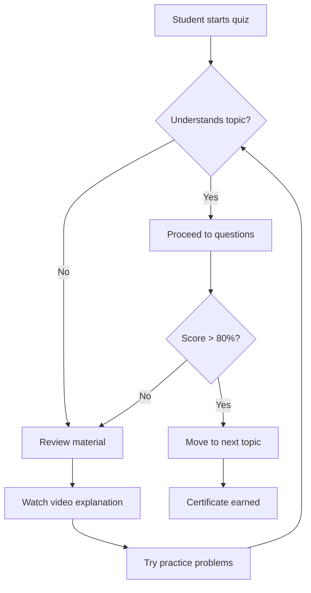

**Use case:** Study paths, decision algorithms, troubleshooting guides

---

### 2. Sequence Diagrams (System Interactions)

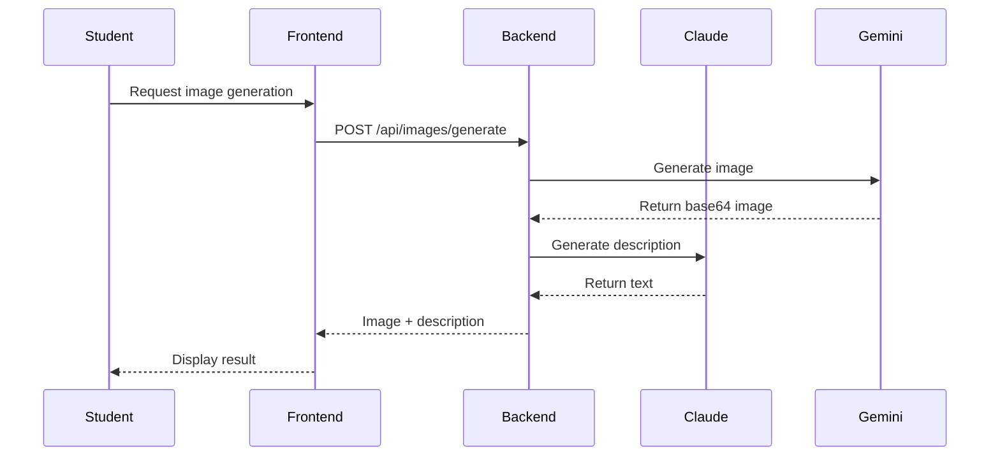

**Use case:** API flows, authentication processes, data pipelines

---

### 3. Class Diagrams (OOP Concepts)

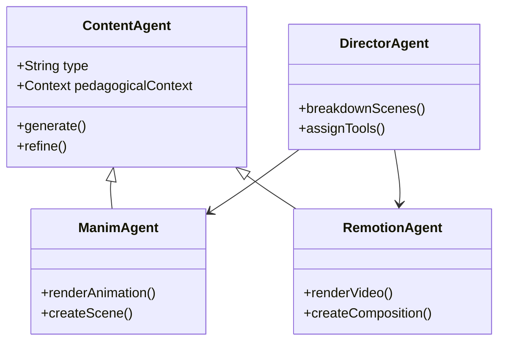

**Use case:** Teaching OOP, system architecture, software design

---

### 4. State Diagrams (System States)

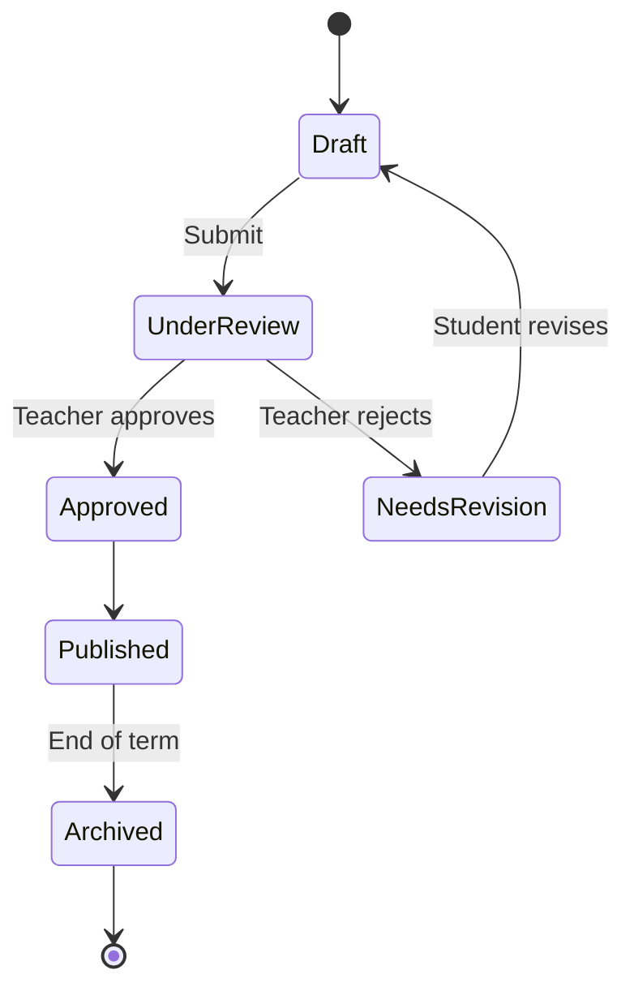

**Use case:** Content lifecycle, student progress, workflow states

---

### 5. Entity Relationship Diagrams (Database Design)

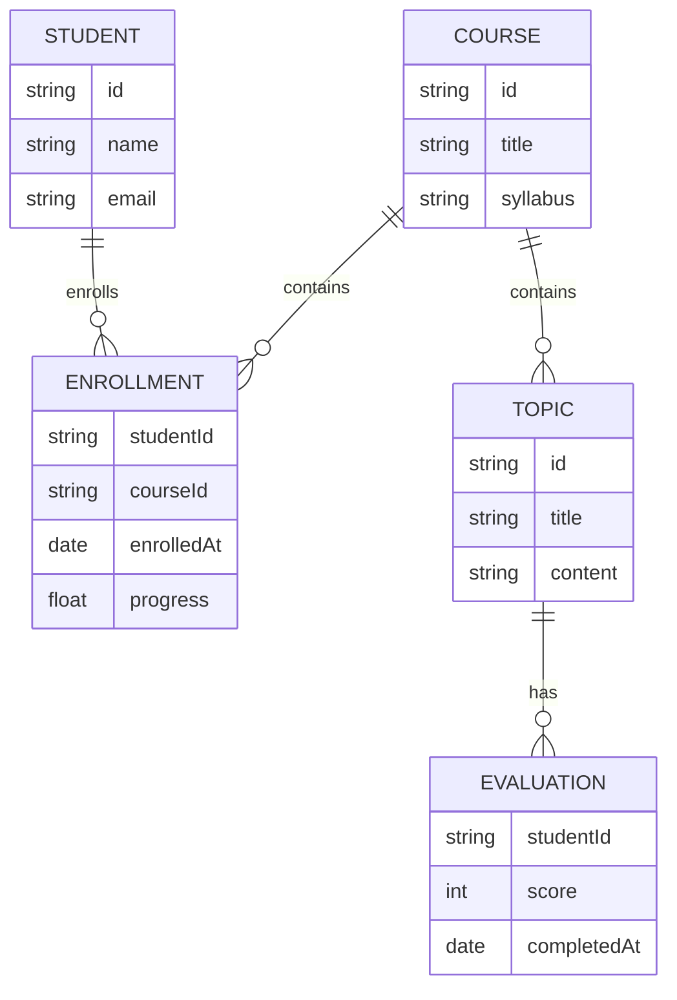

**Use case:** Database design teaching, data modeling

---

### 6. Gantt Charts (Project Timelines)

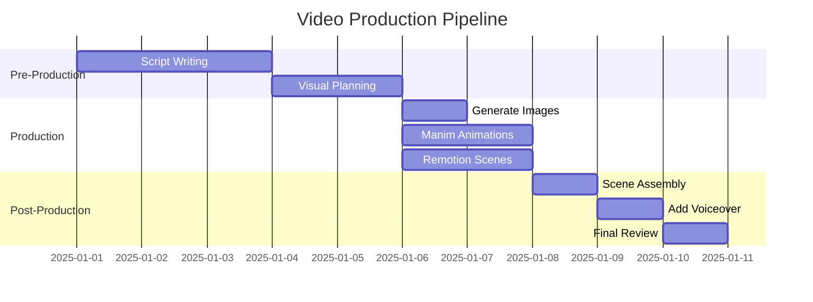

**Use case:** Project planning, student timelines, course schedules

---

### 7. Pie Charts (Data Visualization)

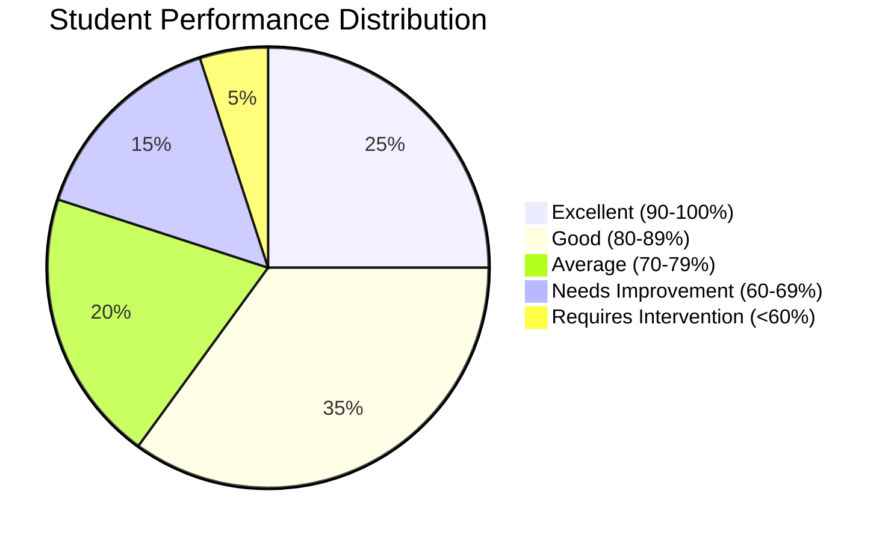

**Use case:** Analytics, performance reports, survey results

---

### 8. Git Graphs (Version Control)

```mermaid
gitgraph
    commit id: "Initial content"
    commit id: "Add images"
    branch feature-animations
    checkout feature-animations
    commit id: "Add Manim scenes"
    commit id: "Polish animations"
    checkout main
    commit id: "Update text"
    merge feature-animations
    commit id: "Final review"
```

**Use case:** Teaching Git, content versioning, collaboration

---

### 9. User Journey Maps

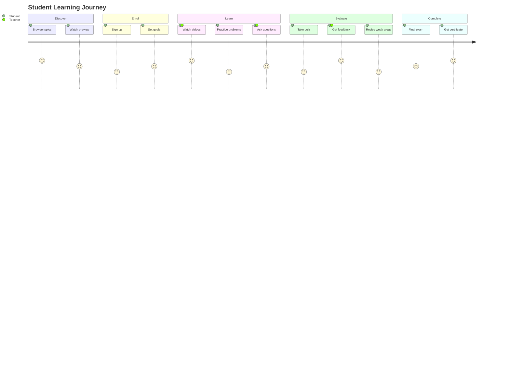

**Use case:** UX design, student experience mapping, process improvement

---

### 10. Mind Maps (Concept Organization)

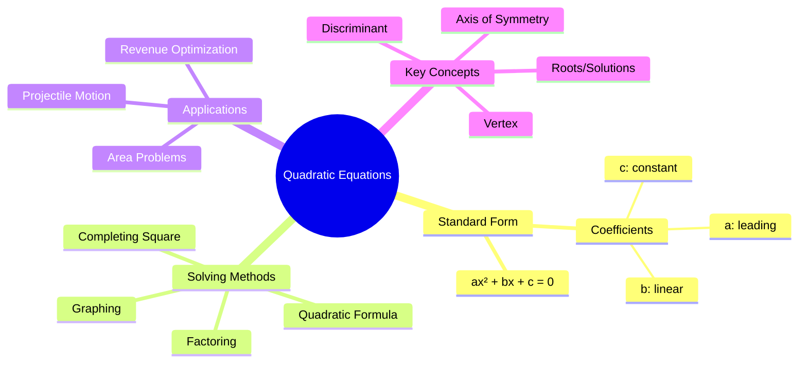

**Use case:** Topic brainstorming, concept mapping, study organization

---

## How Easy Is It To Generate?

### Example: AI-Generated Flowchart

**You ask me:**
> "Create a flowchart showing how a student should approach solving word problems"

**I generate this text:**

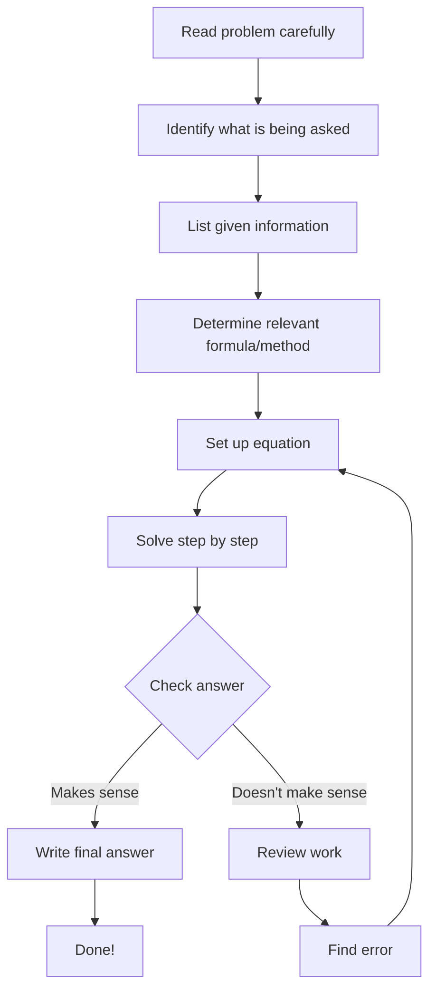

**System renders it instantly** - no manual positioning, no drawing tools needed.

---

## Integration Example

```typescript
// Backend: Generate diagram from user request
router.post('/api/diagrams/generate', async (req, res) => {
  const { topic, type } = req.body;

  // Use Claude to generate Mermaid syntax
  const prompt = `Create a ${type} diagram explaining ${topic}.
  Output only valid Mermaid.js syntax, no explanation.`;

  const mermaidCode = await claudeAPI.generate(prompt);

  // Render to image using mermaid-cli
  const imagePath = await renderMermaid(mermaidCode);

  res.json({
    mermaidCode,
    imageUrl: imagePath
  });
});

// Render function
async function renderMermaid(mermaidCode: string): Promise<string> {
  // Save to temp file
  await fs.writeFile('/tmp/diagram.mmd', mermaidCode);

  // Render with mermaid-cli
  await exec('mmdc -i /tmp/diagram.mmd -o /tmp/diagram.png');

  // Upload to Firebase
  return await uploadToStorage('/tmp/diagram.png');
}
```

---

## Comparison: Mermaid vs Excalidraw

| Feature | Mermaid | Excalidraw |
|---------|---------|------------|
| **Text-based** | ✅ Yes | ❌ JSON structure |
| **Auto-layout** | ✅ Yes | ❌ Manual positioning |
| **AI Generation** | ✅ Easy | ⚠️ Complex |
| **Hand-drawn style** | ❌ No | ✅ Yes |
| **Diagram types** | ✅ 10+ types | ⚠️ Basic shapes |
| **Mathematical notation** | ✅ Supports LaTeX | ❌ Limited |
| **Professional look** | ✅ Clean, modern | ⚠️ Sketch-like |

---

## What I Can Build For You

### Diagram Generation System

```
User: "Explain how authentication works"
           ↓
    Claude generates:
    - Sequence diagram (login flow)
    - Flowchart (decision tree)
    - State diagram (session states)
           ↓
    Mermaid renders to PNG/SVG
           ↓
    Stored in Firebase
           ↓
    Available in content workspace
```

### Teaching System Architecture

```
User: "Create course on Data Structures"
           ↓
    For each topic, generate:
    - Class diagram (structure)
    - Flowchart (algorithm)
    - Complexity chart (performance)
           ↓
    All embedded in lessons
```

---

## Live Example: Generate Right Now

Let me generate a diagram for **your Fundo Platform**:

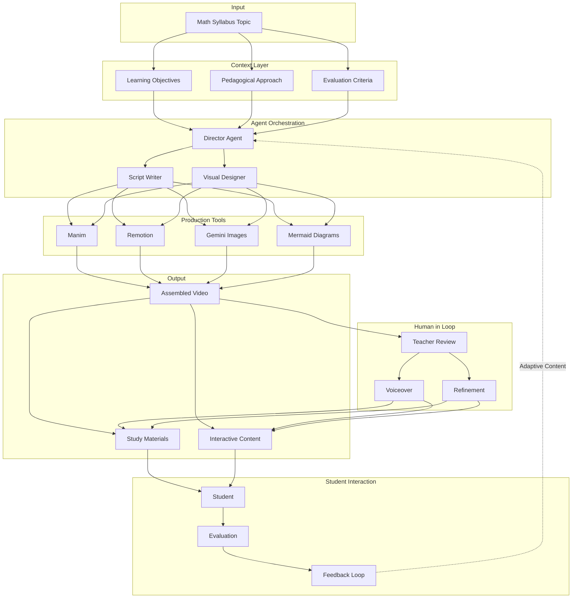

**This took me 2 minutes to write. Excalidraw would take 20+ minutes to position manually.**

---

## Should We Build This?

**Mermaid Integration = High ROI**

- Easy to implement
- Powerful for educational content
- Perfect for AI generation
- Multiple diagram types
- Professional output

**I recommend:**
1. Add Mermaid to your output tools
2. Build Claude → Mermaid generator
3. Integrate with content workspace
4. Use in video production (diagrams as scenes)

Want me to build the Mermaid integration now?
