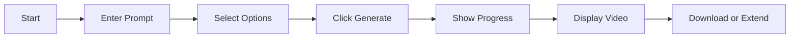
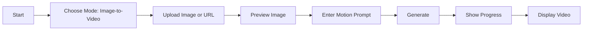
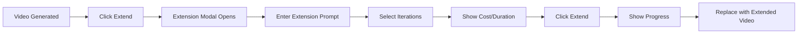
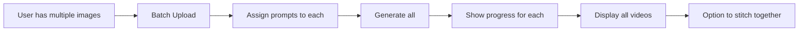

# Veo 3.1 Frontend UI/UX Implementation Guide

Complete guide for frontend developers to build UI for Veo video generation features.

## Table of Contents

1. [Overview](#overview)
2. [Core Features to Support](#core-features-to-support)
3. [User Workflows](#user-workflows)
4. [UI Components](#ui-components)
5. [API Integration](#api-integration)
6. [State Management](#state-management)
7. [User Experience Patterns](#user-experience-patterns)
8. [Error Handling](#error-handling)
9. [Implementation Examples](#implementation-examples)

---

## Overview

The frontend needs to support three main video generation scenarios:

1. **Text-to-Video**: Generate videos from text prompts only
2. **Image-to-Video**: Generate videos from image + prompt
3. **Video Extension**: Extend existing videos up to 148 seconds

### Key UI Requirements

- ✅ Mode selection (text-to-video vs image-to-video)
- ✅ Image upload/URL input
- ✅ Video generation controls
- ✅ Extension workflow (extend generated videos)
- ✅ Progress tracking & cost display
- ✅ Video preview & download
- ✅ Multiple generations management

---

## Core Features to Support

### Feature 1: Text-to-Video Generation

**User Flow:**
```
Enter Prompt → Select Duration/Aspect Ratio → Generate → Preview Video
```

**UI Elements Needed:**
- Text input for prompt (multi-line)
- Duration slider (1-8 seconds)
- Aspect ratio selector (9:16, 16:9, 1:1)
- Optional: negative prompt input
- Generate button with loading state
- Cost estimator display

### Feature 2: Image-to-Video Generation

**User Flow:**
```
Upload Image OR Paste URL → Enter Motion Prompt → Generate → Preview Video
```

**UI Elements Needed:**
- Image upload area (drag & drop)
- Image URL input field
- Image preview thumbnail
- Text input for motion description
- Same controls as text-to-video
- Visual indicator that image mode is active

### Feature 3: Video Extension

**User Flow:**
```
Select Generated Video → Enter Extension Prompt → Choose Iterations → Extend → Preview
```

**UI Elements Needed:**
- Video selector (from previously generated videos)
- Extension prompt input
- Iterations slider (1-20)
- Duration calculator (shows final duration)
- Cost calculator for extensions
- Extend button

### Feature 4: Multiple Generations

**User Flow:**
```
Generate Multiple Videos → Track Progress → Preview All → Download Selected
```

**UI Elements Needed:**
- Queue/list of generations
- Progress indicators for each
- Batch cost tracker
- Grid view of results
- Bulk actions (download all, delete all)

---

## User Workflows

### Workflow 1: Simple Text-to-Video



**UI States:**
1. **Idle**: Input fields enabled, Generate button ready
2. **Generating**: Progress bar, estimated time, cancel button
3. **Complete**: Video player, download button, extend option
4. **Error**: Error message, retry button

### Workflow 2: Image-to-Video



**UI States:**
1. **No Image**: Show upload area, disable generate
2. **Image Loading**: Show spinner on upload area
3. **Image Ready**: Show preview, enable prompt input
4. **Generating**: Same as text-to-video
5. **Complete**: Video player with "Used Image" badge

### Workflow 3: Video Extension



**UI States:**
1. **Extension Available**: Show "Extend Video" button on completed video
2. **Extension Modal**: Show extension controls
3. **Extending**: Progress with iteration counter (e.g., "2/3 iterations")
4. **Complete**: Updated video with new duration

### Workflow 4: Multi-Scene Generation



---

## UI Components

### Component 1: Video Generation Form

**Component Structure:**

```tsx
<VideoGenerationForm>
  <ModeSelector />         // Text-to-Video | Image-to-Video

  {mode === 'image' && (
    <ImageUpload />        // Drag & drop or URL
  )}

  <PromptInput />          // Multi-line text
  <AdvancedOptions>
    <DurationSlider />     // 1-8 seconds
    <AspectRatioSelector /> // 9:16, 16:9, 1:1
    <NegativePromptInput /> // Optional
  </AdvancedOptions>

  <CostEstimator />        // Shows estimated cost
  <GenerateButton />       // Primary action
</VideoGenerationForm>
```

**Props:**
```typescript
interface VideoGenerationFormProps {
  onGenerate: (params: GenerationParams) => Promise<void>;
  isGenerating: boolean;
  costPerSecond: number;
}

interface GenerationParams {
  mode: 'text' | 'image';
  prompt: string;
  duration: number;
  aspectRatio: '9:16' | '16:9' | '1:1';
  negativePrompt?: string;
  image?: File | string; // File or URL
}
```

### Component 2: Image Upload

**Component Structure:**

```tsx
<ImageUpload>
  {!image ? (
    <DropZone>
      <UploadIcon />
      <Text>Drag & drop or click to upload</Text>
      <Text>Supports: JPG, PNG, GIF, WebP</Text>

      <Divider>OR</Divider>

      <URLInput
        placeholder="Paste image URL"
        onSubmit={handleImageURL}
      />
    </DropZone>
  ) : (
    <ImagePreview>
      <Thumbnail src={imagePreview} />
      <FileName>{image.name}</FileName>
      <RemoveButton onClick={clearImage} />
    </ImagePreview>
  )}
</ImageUpload>
```

**Features:**
- Drag and drop support
- File picker on click
- URL input alternative
- Image preview with remove option
- Format validation
- Size limit indicator

### Component 3: Video Extension Modal

**Component Structure:**

```tsx
<ExtensionModal video={selectedVideo}>
  <ModalHeader>
    <Title>Extend Video</Title>
    <CurrentDuration>{video.duration}s</CurrentDuration>
  </ModalHeader>

  <ModalBody>
    <VideoPreview src={video.url} />

    <PromptInput
      label="How should the video continue?"
      placeholder="Continue the motion and add..."
    />

    <IterationsSlider
      min={1}
      max={20}
      value={iterations}
      onChange={setIterations}
    />

    <DurationCalculator>
      <Label>Final Duration:</Label>
      <Value>{video.duration + (iterations × 7)}s</Value>
    </DurationCalculator>

    <CostEstimator>
      <Label>Extension Cost:</Label>
      <Value>${(iterations × 7 × 0.20).toFixed(2)}</Value>
    </CostEstimator>
  </ModalBody>

  <ModalFooter>
    <CancelButton />
    <ExtendButton
      onClick={handleExtend}
      disabled={!prompt}
    >
      Extend Video
    </ExtendButton>
  </ModalFooter>
</ExtensionModal>
```

**Props:**
```typescript
interface ExtensionModalProps {
  video: GeneratedVideo;
  isOpen: boolean;
  onClose: () => void;
  onExtend: (params: ExtensionParams) => Promise<void>;
}

interface ExtensionParams {
  videoId: string;
  prompt: string;
  iterations: number;
}
```

### Component 4: Generation Progress

**Component Structure:**

```tsx
<GenerationProgress generation={activeGeneration}>
  <ProgressHeader>
    <StatusIcon status={generation.status} />
    <Title>{generation.mode} Generation</Title>
  </ProgressHeader>

  <ProgressBar
    value={generation.progress}
    max={100}
  />

  <ProgressDetails>
    {generation.status === 'generating' && (
      <>
        <EstimatedTime>~{generation.estimatedTime}s remaining</EstimatedTime>
        {generation.iterations > 1 && (
          <Iterations>
            Iteration {generation.currentIteration}/{generation.iterations}
          </Iterations>
        )}
      </>
    )}

    {generation.status === 'complete' && (
      <>
        <SuccessMessage>✓ Video generated!</SuccessMessage>
        <Duration>{generation.duration}s video</Duration>
        <Cost>${generation.cost.toFixed(2)}</Cost>
      </>
    )}

    {generation.status === 'error' && (
      <>
        <ErrorMessage>{generation.error}</ErrorMessage>
        <RetryButton onClick={handleRetry} />
      </>
    )}
  </ProgressDetails>

  {generation.status === 'generating' && (
    <CancelButton onClick={handleCancel} />
  )}
</GenerationProgress>
```

### Component 5: Video Gallery/List

**Component Structure:**

```tsx
<VideoGallery videos={generatedVideos}>
  <GalleryHeader>
    <Title>Generated Videos ({videos.length})</Title>
    <ViewToggle /> // Grid | List
    <SortDropdown /> // Newest | Oldest | Duration | Cost
  </GalleryHeader>

  <VideoGrid>
    {videos.map(video => (
      <VideoCard key={video.id}>
        <VideoThumbnail
          src={video.thumbnailUrl}
          onClick={() => handlePreview(video)}
        />

        <VideoInfo>
          <Duration>{video.duration}s</Duration>
          {video.metadata.usedReferenceImage && (
            <Badge>Image-to-Video</Badge>
          )}
          <Timestamp>{formatDate(video.timestamp)}</Timestamp>
        </VideoInfo>

        <VideoActions>
          <PlayButton onClick={() => handlePlay(video)} />
          <ExtendButton onClick={() => handleExtend(video)} />
          <DownloadButton onClick={() => handleDownload(video)} />
          <DeleteButton onClick={() => handleDelete(video)} />
        </VideoActions>
      </VideoCard>
    ))}
  </VideoGrid>
</VideoGallery>
```

---

## API Integration

### API Endpoint 1: Generate Video

**Endpoint:** `POST /api/tiktok/generate-video`

**Request (Text-to-Video):**
```typescript
const response = await fetch('/api/tiktok/generate-video', {
  method: 'POST',
  headers: { 'Content-Type': 'application/json' },
  body: JSON.stringify({
    prompt: 'Aerial view of Victoria Falls with rainbow',
    duration: 8,
    aspectRatio: '9:16',
    modelVersion: '3.1',
    negativePrompt: 'blurry, low quality',
  }),
});

const result = await response.json();
/*
{
  success: true,
  mode: 'text-to-video',
  video: {
    url: 'https://...',
    filename: 'veo-8s-1234567890.mp4',
    duration: 8,
    resolution: '1080x1920',
    sizeMB: '3.74'
  },
  metadata: {
    cost: 1.6,
    generationTimeSeconds: '145.00',
    usedReferenceImage: false
  }
}
*/
```

**Request (Image-to-Video):**
```typescript
// Option 1: Base64 image
const imageBase64 = await fileToBase64(imageFile);

const response = await fetch('/api/tiktok/generate-video', {
  method: 'POST',
  headers: { 'Content-Type': 'application/json' },
  body: JSON.stringify({
    prompt: 'Pan across the landscape with dramatic motion',
    duration: 8,
    aspectRatio: '9:16',
    imageBase64: imageBase64, // 'data:image/jpeg;base64,...'
  }),
});

// Option 2: Image URL
const response = await fetch('/api/tiktok/generate-video', {
  method: 'POST',
  headers: { 'Content-Type': 'application/json' },
  body: JSON.stringify({
    prompt: 'Zoom into the subject with cinematic motion',
    duration: 8,
    aspectRatio: '9:16',
    imageUrl: 'https://example.com/image.jpg',
  }),
});

const result = await response.json();
/*
{
  success: true,
  mode: 'image-to-video',  // ← Different mode
  video: { ... },
  metadata: {
    cost: 1.6,
    usedReferenceImage: true  // ← Indicates image was used
  }
}
*/
```

### API Endpoint 2: Extend Video

**Endpoint:** `POST /api/tiktok/extend-video`

**Request:**
```typescript
const response = await fetch('/api/tiktok/extend-video', {
  method: 'POST',
  headers: { 'Content-Type': 'application/json' },
  body: JSON.stringify({
    videoFilename: 'veo-8s-1234567890.mp4', // From initial generation
    prompt: 'Continue with closer view and dramatic lighting',
    iterations: 3, // Add 21 seconds (3 × 7)
  }),
});

const result = await response.json();
/*
{
  success: true,
  video: {
    filename: 'veo-extended-29s-9876543210.mp4',
    originalDuration: 8,
    extensionDuration: 21,
    totalDuration: 29,
    iterations: 3,
    sizeMB: '12.45'
  },
  metadata: {
    cost: 4.2,  // $1.40 × 3 iterations
    costPerIteration: '1.4000',
    generationTimeSeconds: '456.00'
  }
}
*/
```

### Helper Functions

```typescript
// Convert File to base64
async function fileToBase64(file: File): Promise<string> {
  return new Promise((resolve, reject) => {
    const reader = new FileReader();
    reader.readAsDataURL(file);
    reader.onload = () => resolve(reader.result as string);
    reader.onerror = error => reject(error);
  });
}

// Estimate cost
function estimateCost(duration: number, iterations: number = 0): number {
  const baseCost = duration * 0.20;
  const extensionCost = iterations * 7 * 0.20;
  return baseCost + extensionCost;
}

// Calculate final duration
function calculateExtendedDuration(
  originalDuration: number,
  iterations: number
): number {
  return originalDuration + (iterations * 7);
}

// Format duration for display
function formatDuration(seconds: number): string {
  if (seconds < 60) return `${seconds}s`;
  const minutes = Math.floor(seconds / 60);
  const secs = seconds % 60;
  return `${minutes}m ${secs}s`;
}
```

---

## State Management

### State Structure

```typescript
interface VideoGenerationState {
  // Current form state
  mode: 'text' | 'image';
  prompt: string;
  duration: number;
  aspectRatio: '9:16' | '16:9' | '1:1';
  negativePrompt: string;
  image: File | string | null;
  imagePreview: string | null;

  // Active generations
  activeGenerations: Generation[];

  // Completed videos
  generatedVideos: GeneratedVideo[];

  // UI state
  isGenerating: boolean;
  selectedVideo: GeneratedVideo | null;
  showExtensionModal: boolean;

  // Extension state
  extensionPrompt: string;
  extensionIterations: number;
  isExtending: boolean;

  // Error state
  error: string | null;
}

interface Generation {
  id: string;
  mode: 'text' | 'image';
  status: 'pending' | 'generating' | 'complete' | 'error';
  progress: number; // 0-100
  estimatedTime: number; // seconds remaining
  currentIteration?: number;
  totalIterations?: number;
  error?: string;
}

interface GeneratedVideo {
  id: string;
  filename: string;
  url: string;
  thumbnailUrl?: string;
  duration: number;
  resolution: string;
  aspectRatio: string;
  sizeMB: string;
  cost: number;
  timestamp: string;
  metadata: {
    mode: 'text-to-video' | 'image-to-video';
    model: string;
    usedReferenceImage: boolean;
    prompt: string;
  };
}
```

### Actions

```typescript
// Generation actions
const startGeneration = (params: GenerationParams) => void;
const cancelGeneration = (generationId: string) => void;
const updateGenerationProgress = (generationId: string, progress: number) => void;
const completeGeneration = (generationId: string, video: GeneratedVideo) => void;
const failGeneration = (generationId: string, error: string) => void;

// Extension actions
const openExtensionModal = (video: GeneratedVideo) => void;
const closeExtensionModal = () => void;
const startExtension = (videoId: string, params: ExtensionParams) => void;
const updateExtensionProgress = (videoId: string, iteration: number, total: number) => void;
const completeExtension = (videoId: string, extendedVideo: GeneratedVideo) => void;

// Video management actions
const deleteVideo = (videoId: string) => void;
const downloadVideo = (videoId: string) => void;
const selectVideo = (videoId: string) => void;

// Form actions
const setMode = (mode: 'text' | 'image') => void;
const setPrompt = (prompt: string) => void;
const setDuration = (duration: number) => void;
const setAspectRatio = (ratio: '9:16' | '16:9' | '1:1') => void;
const setImage = (image: File | string) => void;
const clearImage = () => void;
```

---

## User Experience Patterns

### Pattern 1: Progressive Disclosure

**Concept:** Show simple options first, advanced options on demand

```tsx
<GenerationForm>
  <PromptInput />  // Always visible
  <QuickActions>   // Common presets
    <PresetButton>TikTok (9:16, 8s)</PresetButton>
    <PresetButton>Instagram (1:1, 8s)</PresetButton>
    <PresetButton>YouTube (16:9, 8s)</PresetButton>
  </QuickActions>

  <Accordion title="Advanced Options">
    <DurationSlider />
    <AspectRatioSelector />
    <NegativePromptInput />
    <ModelVersionSelector />
  </Accordion>
</GenerationForm>
```

### Pattern 2: Real-time Feedback

**Concept:** Show cost and duration estimates as users make changes

```tsx
<Form onChange={handleFormChange}>
  <DurationSlider
    value={duration}
    onChange={setDuration}
  />

  {/* Update in real-time */}
  <CostEstimate>
    Estimated cost: ${(duration * 0.20).toFixed(2)}
  </CostEstimate>

  {extensionIterations > 0 && (
    <ExtensionEstimate>
      + ${(extensionIterations * 1.40).toFixed(2)} for {extensionIterations} extensions
      = ${totalCost.toFixed(2)} total
    </ExtensionEstimate>
  )}
</Form>
```

### Pattern 3: Guided Extension Flow

**Concept:** Make extension process clear and intuitive

```tsx
<VideoCard video={video}>
  {video.duration < 148 && ( // Can still be extended
    <ExtendButton onClick={openModal}>
      <Icon>➕</Icon>
      Extend Video
      <Hint>Add up to {148 - video.duration}s more</Hint>
    </ExtendButton>
  )}
</VideoCard>

<ExtensionModal>
  <Timeline>
    <CurrentSegment duration={video.duration}>
      Original
    </CurrentSegment>
    <NewSegment duration={extensionIterations * 7}>
      +{extensionIterations * 7}s
    </NewSegment>
  </Timeline>

  <IterationsSlider
    onChange={setIterations}
    renderLabel={(value) => `Add ${value * 7} seconds`}
  />
</ExtensionModal>
```

### Pattern 4: Batch Operations

**Concept:** Generate multiple videos efficiently

```tsx
<BatchGenerationPanel>
  <ImageList>
    {images.map((image, index) => (
      <ImageItem key={index}>
        <Thumbnail src={image.preview} />
        <PromptInput
          placeholder={`Describe motion for image ${index + 1}`}
          value={image.prompt}
          onChange={(prompt) => updateImagePrompt(index, prompt)}
        />
        <RemoveButton onClick={() => removeImage(index)} />
      </ImageItem>
    ))}
  </ImageList>

  <BatchActions>
    <GlobalPrompt
      placeholder="Apply this prompt to all images"
      onApply={applyGlobalPrompt}
    />
    <GenerateAllButton
      onClick={generateBatch}
      disabled={images.some(img => !img.prompt)}
    >
      Generate All ({images.length} videos)
    </GenerateAllButton>
  </BatchActions>

  <CostSummary>
    Total estimated cost: ${(images.length * duration * 0.20).toFixed(2)}
  </CostSummary>
</BatchGenerationPanel>
```

### Pattern 5: Video Preview & Comparison

**Concept:** Easy comparison between original and extended videos

```tsx
<VideoComparison>
  <ComparisonControls>
    <Tab active={view === 'original'} onClick={() => setView('original')}>
      Original (8s)
    </Tab>
    <Tab active={view === 'extended'} onClick={() => setView('extended')}>
      Extended (29s)
    </Tab>
    <Tab active={view === 'side-by-side'} onClick={() => setView('side-by-side')}>
      Side by Side
    </Tab>
  </ComparisonControls>

  {view === 'side-by-side' ? (
    <SideBySide>
      <VideoPlayer src={originalVideo.url} label="Original" />
      <VideoPlayer src={extendedVideo.url} label="Extended" />
    </SideBySide>
  ) : (
    <VideoPlayer src={view === 'original' ? originalVideo.url : extendedVideo.url} />
  )}
</VideoComparison>
```

---

## Error Handling

### Error Types & UI Responses

#### 1. Image Upload Errors

```tsx
<ImageUpload
  onError={(error) => {
    switch (error.type) {
      case 'invalid-format':
        showToast('Please upload JPG, PNG, GIF, or WebP images', 'error');
        break;
      case 'file-too-large':
        showToast(`Image too large. Max size: 10MB`, 'error');
        break;
      case 'upload-failed':
        showToast('Failed to upload image. Please try again.', 'error');
        break;
    }
  }}
/>
```

#### 2. Generation Errors

```tsx
<GenerationProgress generation={generation}>
  {generation.status === 'error' && (
    <ErrorPanel>
      <ErrorIcon />
      <ErrorMessage>{generation.error}</ErrorMessage>

      {generation.error.includes('quota') && (
        <Suggestion>
          You've reached your generation limit.
          <Link>Upgrade plan</Link>
        </Suggestion>
      )}

      {generation.error.includes('timeout') && (
        <Suggestion>
          Generation took too long. Try a shorter duration or simpler prompt.
        </Suggestion>
      )}

      <RetryButton onClick={handleRetry}>
        Try Again
      </RetryButton>
    </ErrorPanel>
  )}
</GenerationProgress>
```

#### 3. Extension Errors

```tsx
<ExtensionModal>
  {extensionError && (
    <Alert variant="error">
      <AlertTitle>Extension Failed</AlertTitle>
      <AlertDescription>{extensionError}</AlertDescription>

      {extensionError.includes('maximum duration') && (
        <Suggestion>
          This video has reached the maximum duration (148s).
          Try generating a new video instead.
        </Suggestion>
      )}

      {extensionError.includes('video not found') && (
        <Suggestion>
          The original video file is missing.
          Please generate a new video.
        </Suggestion>
      )}
    </Alert>
  )}
</ExtensionModal>
```

---

## Implementation Examples

### Example 1: Complete Generation Component (React)

```tsx
import React, { useState } from 'react';

export function VideoGenerator() {
  const [mode, setMode] = useState<'text' | 'image'>('text');
  const [prompt, setPrompt] = useState('');
  const [image, setImage] = useState<File | null>(null);
  const [imagePreview, setImagePreview] = useState<string | null>(null);
  const [duration, setDuration] = useState(8);
  const [aspectRatio, setAspectRatio] = useState<'9:16' | '16:9' | '1:1'>('9:16');
  const [isGenerating, setIsGenerating] = useState(false);
  const [generatedVideo, setGeneratedVideo] = useState<any>(null);

  const handleImageUpload = async (file: File) => {
    setImage(file);

    // Create preview
    const reader = new FileReader();
    reader.onload = (e) => setImagePreview(e.target?.result as string);
    reader.readAsDataURL(file);
  };

  const handleGenerate = async () => {
    setIsGenerating(true);

    try {
      let requestBody: any = {
        prompt,
        duration,
        aspectRatio,
        modelVersion: '3.1',
      };

      // Add image if in image mode
      if (mode === 'image' && image) {
        const imageBase64 = await fileToBase64(image);
        requestBody.imageBase64 = imageBase64;
      }

      const response = await fetch('/api/tiktok/generate-video', {
        method: 'POST',
        headers: { 'Content-Type': 'application/json' },
        body: JSON.stringify(requestBody),
      });

      const result = await response.json();

      if (result.success) {
        setGeneratedVideo(result);
      } else {
        alert('Generation failed: ' + result.error);
      }
    } catch (error: any) {
      alert('Error: ' + error.message);
    } finally {
      setIsGenerating(false);
    }
  };

  const estimatedCost = duration * 0.20;

  return (
    <div className="video-generator">
      {/* Mode Selector */}
      <div className="mode-selector">
        <button
          className={mode === 'text' ? 'active' : ''}
          onClick={() => setMode('text')}
        >
          Text-to-Video
        </button>
        <button
          className={mode === 'image' ? 'active' : ''}
          onClick={() => setMode('image')}
        >
          Image-to-Video
        </button>
      </div>

      {/* Image Upload (if image mode) */}
      {mode === 'image' && (
        <div className="image-upload">
          {!imagePreview ? (
            <label className="upload-area">
              <input
                type="file"
                accept="image/*"
                onChange={(e) => e.target.files && handleImageUpload(e.target.files[0])}
              />
              <span>Click to upload image or drag & drop</span>
            </label>
          ) : (
            <div className="image-preview">
              
              <button onClick={() => { setImage(null); setImagePreview(null); }}>
                Remove
              </button>
            </div>
          )}
        </div>
      )}

      {/* Prompt Input */}
      <textarea
        value={prompt}
        onChange={(e) => setPrompt(e.target.value)}
        placeholder={mode === 'text'
          ? "Describe the video you want to generate..."
          : "Describe how to animate the image..."
        }
        rows={4}
      />

      {/* Duration Slider */}
      <div className="duration-control">
        <label>Duration: {duration}s</label>
        <input
          type="range"
          min={1}
          max={8}
          value={duration}
          onChange={(e) => setDuration(Number(e.target.value))}
        />
      </div>

      {/* Aspect Ratio */}
      <div className="aspect-ratio-selector">
        <label>Aspect Ratio:</label>
        <select value={aspectRatio} onChange={(e) => setAspectRatio(e.target.value as any)}>
          <option value="9:16">9:16 (TikTok)</option>
          <option value="16:9">16:9 (YouTube)</option>
          <option value="1:1">1:1 (Instagram)</option>
        </select>
      </div>

      {/* Cost Estimate */}
      <div className="cost-estimate">
        Estimated cost: ${estimatedCost.toFixed(2)}
      </div>

      {/* Generate Button */}
      <button
        onClick={handleGenerate}
        disabled={isGenerating || !prompt || (mode === 'image' && !image)}
        className="generate-button"
      >
        {isGenerating ? 'Generating...' : 'Generate Video'}
      </button>

      {/* Generated Video */}
      {generatedVideo && (
        <div className="generated-video">
          <h3>✓ Video Generated!</h3>
          <video src={generatedVideo.video.url} controls />
          <div className="video-info">
            <p>Mode: {generatedVideo.mode}</p>
            <p>Duration: {generatedVideo.video.duration}s</p>
            <p>Cost: ${generatedVideo.metadata.cost.toFixed(2)}</p>
          </div>
          <button onClick={() => window.open(generatedVideo.video.url)}>
            Download
          </button>
        </div>
      )}
    </div>
  );
}

async function fileToBase64(file: File): Promise<string> {
  return new Promise((resolve, reject) => {
    const reader = new FileReader();
    reader.onload = () => resolve(reader.result as string);
    reader.onerror = reject;
    reader.readAsDataURL(file);
  });
}
```

### Example 2: Extension Modal Component

```tsx
import React, { useState } from 'react';

interface ExtensionModalProps {
  video: any;
  isOpen: boolean;
  onClose: () => void;
  onExtensionComplete: (extendedVideo: any) => void;
}

export function ExtensionModal({
  video,
  isOpen,
  onClose,
  onExtensionComplete
}: ExtensionModalProps) {
  const [prompt, setPrompt] = useState('');
  const [iterations, setIterations] = useState(1);
  const [isExtending, setIsExtending] = useState(false);

  if (!isOpen) return null;

  const extensionDuration = iterations * 7;
  const finalDuration = video.duration + extensionDuration;
  const extensionCost = iterations * 7 * 0.20;

  const handleExtend = async () => {
    setIsExtending(true);

    try {
      const response = await fetch('/api/tiktok/extend-video', {
        method: 'POST',
        headers: { 'Content-Type': 'application/json' },
        body: JSON.stringify({
          videoFilename: video.filename,
          prompt,
          iterations,
        }),
      });

      const result = await response.json();

      if (result.success) {
        onExtensionComplete(result);
        onClose();
      } else {
        alert('Extension failed: ' + result.error);
      }
    } catch (error: any) {
      alert('Error: ' + error.message);
    } finally {
      setIsExtending(false);
    }
  };

  return (
    <div className="modal-overlay" onClick={onClose}>
      <div className="modal-content" onClick={(e) => e.stopPropagation()}>
        <div className="modal-header">
          <h2>Extend Video</h2>
          <button onClick={onClose}>×</button>
        </div>

        <div className="modal-body">
          {/* Video Preview */}
          <div className="video-preview">
            <video src={video.url} controls />
            <div className="current-duration">
              Current: {video.duration}s
            </div>
          </div>

          {/* Extension Prompt */}
          <div className="prompt-input">
            <label>How should the video continue?</label>
            <textarea
              value={prompt}
              onChange={(e) => setPrompt(e.target.value)}
              placeholder="Continue with closer view and dramatic lighting..."
              rows={3}
            />
          </div>

          {/* Iterations Slider */}
          <div className="iterations-control">
            <label>Extensions: {iterations} (adds {extensionDuration}s)</label>
            <input
              type="range"
              min={1}
              max={20}
              value={iterations}
              onChange={(e) => setIterations(Number(e.target.value))}
            />
            <div className="iteration-info">
              1 iteration = 7 seconds | Max: 20 iterations
            </div>
          </div>

          {/* Duration Timeline */}
          <div className="duration-timeline">
            <div className="timeline-bar">
              <div
                className="original-segment"
                style={{ width: `${(video.duration / finalDuration) * 100}%` }}
              >
                Original {video.duration}s
              </div>
              <div
                className="extension-segment"
                style={{ width: `${(extensionDuration / finalDuration) * 100}%` }}
              >
                +{extensionDuration}s
              </div>
            </div>
            <div className="final-duration">
              Final duration: {finalDuration}s
            </div>
          </div>

          {/* Cost Estimate */}
          <div className="cost-estimate">
            <div>Extension cost: ${extensionCost.toFixed(2)}</div>
            <div className="cost-breakdown">
              ({iterations} iterations × 7s × $0.20)
            </div>
          </div>
        </div>

        <div className="modal-footer">
          <button onClick={onClose} disabled={isExtending}>
            Cancel
          </button>
          <button
            onClick={handleExtend}
            disabled={!prompt || isExtending}
            className="primary-button"
          >
            {isExtending ? 'Extending...' : `Extend Video (+${extensionDuration}s)`}
          </button>
        </div>
      </div>
    </div>
  );
}
```

---

## Summary

### Frontend Must Support:

1. **Generation Modes**
   - ✅ Text-to-video generation
   - ✅ Image-to-video generation (with upload/URL)
   - ✅ Mode switching in UI

2. **Video Extension**
   - ✅ Extension modal/panel
   - ✅ Iteration selection (1-20)
   - ✅ Real-time cost/duration calculator
   - ✅ Extension progress tracking

3. **Multiple Scenarios**
   - ✅ Single generation workflow
   - ✅ Batch generation from multiple images
   - ✅ Sequential extensions (extend → extend again)
   - ✅ Video library/gallery management

4. **User Experience**
   - ✅ Real-time cost estimates
   - ✅ Progress indicators
   - ✅ Error handling with helpful messages
   - ✅ Video preview and download
   - ✅ Clear visual distinction between modes

### Key API Endpoints:

- `POST /api/tiktok/generate-video` - Text or image-to-video
- `POST /api/tiktok/extend-video` - Extend existing videos

### Implementation Priority:

1. **Phase 1**: Basic text-to-video UI
2. **Phase 2**: Image upload and image-to-video
3. **Phase 3**: Extension modal and workflow
4. **Phase 4**: Batch operations and advanced features

This guide provides everything your frontend team needs to implement comprehensive Veo video generation features! 🎬
