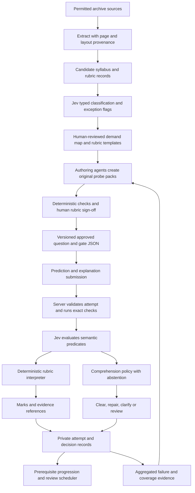

# Jev in education: assess the explanation, organise the evidence

**Design investigation and implementation plan · 20 September 2026 · Astra**

**Recommendation:** make the paid product a record of demonstrated understanding, earned through prediction, explanation, transfer and delayed retrieval. Use the archive to discover which demonstrations matter. Run a bounded Biology marking trial alongside the existing Mechanics work; do not divert the whole product into a general-purpose marker.

This is a proposal for synthesis, not an amendment silently applied to the approved plans. It separates observations, external evidence and hypotheses. No ten-year archive was supplied at a filesystem location in this brief; the investigation below examines the repository and public primary sources, and specifies how to classify Durai's archive. It does **not** invent archive frequencies, Jev accuracy rates or learner outcomes.

## 1. The argument I would defend

Three product changes belong together:

1. **The archive becomes an assessment map.** A syllabus names content; papers reveal the operations, representations, combinations and conditions under which candidates must use it. Generate practice against those demands, including neglected prerequisites and unfamiliar contexts.
2. **A mark scheme becomes an executable, reviewable contract.** Jev judges whether supplied evidence satisfies explicit predicates. Code applies dependencies, alternatives, caps and follow-through. A human approves the contract and its boundary cases. This is the foundation for both prose marking and defensible comprehension gates.
3. **A notes page becomes a short examination of an idea.** The student predicts, encounters the model, explains the discrepancy, then handles a changed case. Progress records what the student demonstrated, under which conditions and with how much help. Later practice tests whether that understanding survives.

The strongest asset is the connection between these three: **exam demand → discriminating question → observed reasoning → specific repair → successful transfer**. A cheap classifier alone is available to competitors. The accumulating, reviewed relationship between questions, mistakes and successful repairs is harder to reproduce.

Two claims in the brief need narrowing. Biology prose marking already exists commercially, and reasoning assessment has a long research history. Neither invalidates the opportunity. They do rule out a strategy based on being the first system that can read an explanation. The useful wager is that cheap, fast, typed judgements let this team build a dependable learning loop across far more interactions than a human marking service can cover.

### Fixed assumptions

- [Jev working notes](jev-system-one.md) are the local source of truth: `noul`, `choice`, `score`; probabilities with every judgement; no generated prose. Approximately 410 ms with a warm connection; ten simultaneous questions measured about the same latency as one. Measured pricing is $0.042/M input tokens, output free, approximately $0.000019 for the observed small decision. Budget judgements as effectively free. Review time, reliability, rate limits and learner patience remain constraints.
- `noul` evaluates a proposition; `choice` selects among supplied alternatives; `score` evaluates supplied ordered levels. None extracts arbitrary text, invents a misconception code, writes a question or produces a justification. Extraction and authoring use deterministic tools or authoring agents; runtime wording comes from approved templates.
- [ROADMAP §1a](../apps/student-learn/briefs/ROADMAP-to-revenue.md) takes precedence over the older priority ordering: artifacts and the question bank are one assessment workstream. Free exemplars attract students; comprehensive practice with persistent evidence is paid. Notes retain their free entitlement; advancement through the guided journey requires evidence.
- Notes progression is gated. The design question is how to gather sufficient evidence without trapping a learner. Human marking remains a separately described service; automatic formative feedback must not impersonate a paid human verdict.
- All sample questions below are proposed original teaching items unless explicitly identified as an official-paper observation. New Biology, Chemistry, Pure and Statistics codes are **provisional product identifiers**, not entries already present in the catalogue or official syllabus-point numbers.

## 2. Repository findings that change the design

The [marking amendments](../apps/student-learn/briefs/PLAN-marking-platform.md) correctly identify review and diagnostic coverage as bottlenecks. Reading the implementation makes the issue sharper.

| Observed on disk | Product implication |
|---|---|
| [Mechanics catalogue](../apps/student-learn/content/misconceptions/mechanics.json): 21 codes, four labelled covered at two questions, 17 partial; at three questions, zero qualify. | These are inventory labels, not evidence that a learner can be diagnosed and remediated. |
| [Emitted bank](../apps/student-learn/content/questions/mechanics-forces-f-equals-ma.json): 12 questions; **zero contain `provenance.approvedBy`**. | Under the stated serving rule, these 12 contribute zero approved question coverage. Report authored, machine-checked and approved coverage separately. |
| [Authoring source](../apps/student-learn/content/questions/sources/mechanics-forces-f-equals-ma.py): 13 items, including an un-emitted `M4.4d-003`; eight of the 12 shared items have different `diagnosticFor` tags from emitted JSON. | Rebuilding can change the claimed diagnostic coverage. Example: `M4.4a-002` is tagged `M4.4a-X02` in source but `M4.4a-X03` in JSON. Resolve lineage before adding volume. |
| [Solve gate](../apps/student-learn/scripts/build-exercise-questions.py) checks numeric agreement and tariff sum, but only checks that a dependency ID exists. A route name containing `symbolic` satisfies that structural test. | It does not establish that each mark is justified, dependencies target the right kind of point, alternate methods earn fairly, or the three routes are genuinely independent. The first item's direct division and reciprocal multiplication are essentially the same argument. |
| The gate still rejects recurring decimals and enforces one broad magnitude band. | Amendment F is not implemented there. The archive can expose the resulting bank bias, but code must enforce a suitable subject/item-specific numeric contract. |
| `MarkSchemeStep` only has a type, integer marks, prose, optional LaTeX and one `dependsOn`. | It cannot represent capped point lists, multiple dependencies, route exclusivity, explicit rejection rules or executable follow-through. |
| [Progress](../apps/student-learn/lib/progress.ts) already delegates to a Convex-backed store, with [server progress functions](../apps/student-learn/convex/progress.ts). | Do not plan the already-existing persistence swap again. Extend it with misconception-level evidence; topic quiz percentages are insufficient. |
| Existing progress mutations accept client-supplied scores/thresholds, and a setter accepts a skill state. | They are not an authority for a new verified gate. Imported/local/legacy progress must not unlock server-verified comprehension. |

The three artifacts are excellent teaching probes, but they are not yet valid cold diagnostic instruments:

- [Pulley](../apps/student-learn/components/interactive/pulley-predict.tsx), `M4.4d-X02`: the default guess is already 10. A commit is not evidence the learner independently chose free fall. The title reveals the correction, the SVG accessibility label contains acceleration before commitment, and the diagram displays tension. Preserve an accessible teaser, but label the resulting evidence as exposed or collect a neutral baseline first.
- Its dial advances by 0.5 while correctness uses a 0.05 tolerance. With 7 kg on the table and 4 kg hanging, the answer is `40/11 ≈ 3.636`; **no selectable answer is counted correct**. A comprehension gate built on that event would punish the input control. Use a conceptual prediction or a valid numeric-entry contract.
- `m₁ = 0` is deliberately available. At that boundary the ideal model gives `a = g`; the diagnostic predicate must include the case assumptions. Also replace the ambiguous instruction about releasing the string with releasing the **system from rest**: cutting a string is a different experiment.
- [Friction](../apps/student-learn/components/interactive/friction-bench.tsx) distinguishes `M4.1e-X01` (always using `μR`) from `M4.4e-X01` (using `μm`), but [shared analytics](../apps/student-learn/components/interactive/artifact-shell.tsx) retain only right/wrong and the primary code. That is appropriate aggregate analytics, insufficient private learning evidence.
- [Slope](../apps/student-learn/components/interactive/slope-resolver.tsx), `M4.1d-X01`, makes the `θ → 0` counterexample tangible. At 45°, however, sine and cosine coincide. A numerical success there cannot discriminate the swapped rule.
- The shared gate reveals feedback and allows later option changes. Those later clicks are reading, not independent retrieval. Preserve the first committed response and subsequent help/exposure separately.

**Audit the catalogue itself before making it authoritative.** `M4.4d-X01` currently risks rejecting any single-equation pulley solution. A correctly derived scalar relation `(m_heavy − m_light)g = (m_heavy + m_light)a`, or an energy method, can be valid. The misconception is an invalid system/vector treatment, not the number of equations written. `M4.4d-X02` also joins `a = g` and `T = mg`, although these imply different acceleration claims for the hanging body. Keep separate diagnostic predicates even if both remain under a parent code. A closed catalogue needs a `none_of_these / insufficient_evidence / possible_new_error` escape; it must never force a wrong label.

These are prerequisites for a different product promise, not a general code-cleanup programme.

## 3. What ten years of papers can actually yield

### 3.1 Extract assessment structure at the marking-point level

Do not store a paper as a large chunk with a topic label. Keep `paper → question → part → mark point`, with relationships to stimulus material, earlier parts, alternative methods and examiner comments. Preserve subject, component, variant, session, year, syllabus version, source hash and page coordinates.

| Extracted dimension | Example decision, using supplied candidates | What it enables |
|---|---|---|
| Syllabus mapping, potentially several points | `noul`: “Does this part require resolving perpendicular to an inclined plane?” | Find missing combinations rather than count vaguely related questions. |
| Assessed skill versus assumed prerequisite | `choice`: `directly_credited / prerequisite_only / incidental / absent` for a proposed skill | Distinguish marks explicitly available from skills that unlock later marks. |
| Operation and command | `choice`: `calculate / justify / compare / infer / evaluate / design / other` | Build practice that asks students to do what exams require. |
| Representation and conversion | Separate `noul`s for diagram→equation, prose→model, graph→claim, observation→mechanism | Discover that “knows forces” fails specifically when translating the picture. |
| Diagnostic affordance | `noul`: “Could a learner using `M4.1e-X01` obtain the correct response in this case?” | Reject false diagnostics: a sliding-friction item may not distinguish the belief that friction is always limiting. |
| Counterfactual damage | `noul` per point: “Would this stated wrong model prevent this mark under this rubric?” | Estimate which marks a misconception threatens, subject to validation. |
| Rubric shape | `choice`: `method_chain / capped_points / grouped_points / alternative_routes / levelled / visual / unsupported` | Route to the smallest appropriate marking engine. |
| Examiner-observed error | `choice` over supplied codes plus `unmapped`, on a retrieved report paragraph | Ground a proposed misconception in observed responses, not our imagination. |
| Context and scaffold | `noul`s: earlier answer supplied? formula supplied? unfamiliar context? result given? | Control task difficulty and avoid claiming independent mastery after a scaffold. |
| Reuse family | `choice` among retrieved family IDs plus `new_family` | Distinguish a new demand from a number swap. |

Multi-label syllabus/misconception mapping needs multiple `noul`s, not a forced single-choice winner. Candidate retrieval happens first using known syllabus sections and search; Jev judges that shortlist. Save all probabilities and abstentions. A `score` for estimated cognitive demand is a hypothesis with ordered anchors, not measured item difficulty.

**A paper reveals examiner demand, not learner prevalence.** A question that can punish `M4.4a-X01` does not establish that students hold it. Keep three independent evidence fields: `affordance_from_item`, `reported_in_examiner_report`, `observed_in_student_work`. Never turn an examiner's “many” into an invented percentage. Where reports provide explicit response fractions, preserve their cohort and item denominator.

### 3.2 An official sample shows why flat extraction fails

In Biology **9700/21, June 2024, Q2(a), printed p.8**, a three-mark cap sits over more than three possible points; one effect must be linked to an earlier property, and an alternative-valid-point provision remains open. The same page's Q2(b)(ii) offers different allocations for equivalent comparisons. Underlining carries marking meaning. The front matter says the published scheme omits the standardisation meeting's discussions of alternative answers. Preserve the page layout and treat extraction as provisional. [Official Biology mark scheme](https://www.cambridgeinternational.org/Images/566823-june-2024-mark-scheme-paper-21.pdf)

Mechanics **9709/41, June 2024**, includes follow-through with a specific exception in Q1(b), alternative energy/Newton routes, and dependent method marks in Q5(b). Its general rules distinguish M/A/B, dependent marks and permitted follow-through. Therefore a global “wrong earlier answer means lose later accuracy” rule is inadequate. [Official Mechanics mark scheme](https://www.cambridgeinternational.org/Images/673787-june-2024-mark-scheme-paper-41.pdf)

Chemistry **9701/21, June 2024**, combines prose, equations and diagrams: Q1(c)(ii) requires a named role **and** its explanation; Q5(c)(ii) awards for particular arrow origins/destinations and an intermediate. Its science rules address contradictions, list ordering and irrelevant errors. A word-presence counter cannot implement these distinctions. Also, local labels such as `M1`, `M2` must be interpreted in that document's convention, not automatically as Mathematics tariff types. [Official Chemistry mark scheme](https://www.cambridgeinternational.org/Images/567189-june-2024-mark-scheme-paper-21.pdf)

The Biology examiner report supplies a different layer of evidence: non-comparative descriptions where a comparison was requested, enzyme vocabulary used for antibodies, and relevant theory not applied to the supplied context. These are candidate **reasoning operations** to teach, not merely missing facts. [June 2024 examiner report, Paper 21 commentary](https://www.cambridgeinternational.org/Images/566822-june-2024-examiner-report.pdf)

### 3.3 Build a demand map without pretending to predict the next paper

Use the last ten **complete, available** examination years, recording missing sessions. Start with a current-syllabus window and maintain the older window separately. Older paper numbering and optional routes must be mapped by that year's syllabus; do not classify all historical Paper 4/5/6 files using today's meaning. Revisions, replacement papers, specimens and near-duplicate variants need explicit status.

For each component/session/variant, calculate:

```text
explicit_mark_share(skill) = attributable rubric marks / paper marks
encounter_rate(skill)      = eligible papers containing skill / eligible papers
prerequisite_exposure      = downstream tasks that require skill, reported separately
diagnostic_opportunities   = distinct families that separate correct and wrong models
```

Give each awarded mark one total unit of attribution across multi-tagged skills, or label a second view as overlapping. Otherwise totals quietly exceed 100%. Average variants within a session before pooling years; a year with more available variants must not gain accidental weight. Weight components by the learner's actual examination route. Show sample counts, syllabus windows and uncertainty from resampling whole papers/session groups. Do not fabricate candidate counts for variants whose entries are unknown.

First output: a matrix of **syllabus point × operation × representation × misconception**, with marks, families and source references in each populated cell. A useful row might eventually read: “`M4.1e-X02`, perpendicular balance before friction, angled external force, three independent task families, insufficient approved transfer practice.” The numbers must come from ingestion, not this proposal.

Use early years for discovery and later complete sessions for a chronological holdout. Test whether the map predicts the **mix of demands** in held-out papers better than uniform syllabus weighting. Do not advertise a question forecast or infer that a rarely seen syllabus point is safe to omit. Cambridge itself warns that older papers can diverge from current syllabuses. [Cambridge guidance on older papers](https://help.cambridgeinternational.org/hc/en-gb/articles/28848818110098-Why-can-t-I-access-older-past-papers)

### 3.4 What this changes about content production

**Prioritisation becomes expected repair value.** Use separate examiner and learner signals, with a plain operational ranking:

```text
priority(code) = eligible_learners
              × current-syllabus demand weight
              × estimated failure prevalence among exposed learners
              × repairable mark impact
              × practice-gap factor
              / human authoring-and-review hours
```

Before learner data, mark prevalence unknown and use teacher/report evidence as a provisional ranking band. Do not substitute Jev's confidence that an error occurred for its prevalence. Use distinct exposed learners as the denominator; successful remediation otherwise makes a valuable topic appear unimportant, and heavy users dominate raw attempt counts. Preserve some exploration traffic/practice across low-frequency and new syllabus demands.

Resolve amendment M with a scale anchored to downstream reach:

| Severity | Anchor | Mechanics example |
|---|---|---|
| 1 | Isolated presentation defect with little effect on later reasoning | A local notation omission, where the rubric actually cares |
| 2 | Local execution mistake affecting one result | A verified arithmetic slip; usually an error class, not a durable misconception |
| 3 | Wrong interpretation within a bounded task family | `M4.4c-X02`, confusing cable tension with passenger contact force |
| 4 | Invalid operation reused across several families | `M4.1a-X03`, counting a force and its components |
| 5 | Foundational model error that obstructs several downstream skills | `M4.1e-X02`, using `R = mg` irrespective of the perpendicular balance |

Severity is a reviewed catalogue property with examples and evidence, not a new model score on every attempt. Keep exam frequency, lost marks and learner certainty out of this scale so they are not counted twice in the ranking. Jev `score` can flag inconsistent assignments for review. The exact existing 1–5 values should be audited against these anchors rather than grandfathered in.

**Generation becomes a coverage brief.** Instead of “write ten friction questions”, emit:

> Author three approved probes for `M4.1e-X02`: a horizontal floor with an upward angled pull; a rough slope with no extra normal force; a downward angled push. Require the perpendicular equation and ask what changes in the friction limit. One should be a delayed transfer task with different wording. Avoid degeneracies where both models predict the same answer. Supply valid alternative methods and two plausible wrong solutions per item.

Agents author the stem, figures, solutions and rubric. Code checks the model, dimensions, parameter constraints and answer tolerances. Jev evaluates scope and discriminating power against supplied correct/wrong reasoning. Humans approve the rubric plus the adversarial answer set. **Changing numbers, names and wording is not an originality test.** Prefer deriving an abstract skill specification from several sources and independently authoring an item; preserve lineage and the existing legal review gate.

### 3.5 Replace a question-count gate with a coverage contract

My recommended resolution of amendment L is **three distinct evidence roles per misconception**, fulfilled by approved, discriminating items: diagnosis; immediate repair/near transfer; delayed or unfamiliar transfer. Three number variants of one template do not meet that contract. A code also needs a repair explanation, known acceptable reasoning, an ambiguity route and a way to demonstrate transfer without copying the exposed model.

Retain the existing floor of ≥80% of in-scope codes and the per-syllabus-point practice obligation, after removing `-fable` duplicates. Add a proposed **≥90% demand-weighted diagnostic coverage** and complete coverage of the essential prerequisite chains for the scope being sold. This is a proposed stricter launch policy, not evidence that 90% is an empirically optimal threshold. Report denominators openly; “Mechanics forces pilot” is a legitimate scope, “complete Mechanics” with only the 21 force-related codes is not.

```text
code_covered(c) = approved diagnostic + approved repair probe + approved transfer probe
                 + accessible remediation + validated gate/fallback

demand_coverage = sum(unique mark weights served by covered demand cells)
                 / sum(all in-scope mark weights)
```

Two cautions: an item tagged with three codes does not necessarily discriminate all three; and a capped question can contain more acceptable points than its tariff, so summing its point inventory must not inflate demand. Audit both. Keep prescription misses and actual learner transfer in the launch report; inventory completeness is necessary, not sufficient.

### 3.6 Other assets buried in the archive

| Archive pattern | Product capability | Evidence limitation |
|---|---|---|
| Repeated transitions between representations | A bridge course: diagram→equation, graph→claim, observation→mechanism | Co-occurrence alone does not prove a prerequisite relationship. |
| Differences between credited explanations and near misses | Practice choosing the **necessary causal link**, followed by writing it | Do not turn precise terminology into a universal keyword fetish. |
| Method marks that survive early mistakes | Practise recovering a solution after an error instead of restarting | Follow-through is item-specific; not every later mark survives. |
| Given-answer and “show that” questions | A supply of tasks where the final answer contains almost no diagnostic information | Circular derivations must be tested explicitly. |
| Optional points, caps and alternatives | Minimal-complete-answer practice: write enough valid, distinct reasoning | Optimising brevity must not reward incomplete science. |
| Distractors plus examiner response commentary | A library of competing mental models and discriminating probes | A distractor is a hypothesis until an explanation supports it. |
| Rubric changes across syllabus revisions | A migration queue for questions, gates and learner evidence | Old rules must remain attached to historical attempts. |
| Contradictory source interpretations | A teacher calibration set; preserve disagreements and resolution | Published materials are not an exhaustive executable oracle. |
| Parameter regimes where wrong and correct rules coincide | Prevent false mastery from special cases such as a 45° slope | Needs deterministic counterexamples, not just a relevance tag. |

A marks-at-risk view could then say: “Your normal-reaction reasoning threatens several friction tasks; one repaired idea may help across them.” Initially show linked task families, not a falsely precise grade increase. To estimate recovered marks, replay complete rubrics under explicit counterfactual assumptions; do not add overlapping losses independently.

### 3.7 The archive is not automatically a publication licence

The earlier plan records a 403 while checking Cambridge's policy. The official permissions page was accessible in this investigation: it states restrictions on electronic publication of past-paper questions and reproduction of mark schemes and examiner reports. That materially weakens the assumed “real papers on TikTok” route. [Cambridge permissions policy](https://help.cambridgeinternational.org/hc/en-gb/articles/115004418469-How-do-I-apply-for-permission-to-use-Cambridge-copyrighted-material)

Keep source access, internal analysis, provider processing and public reuse as separate rights decisions. An owned archive does not settle those rights; anonymising wording or varying numbers does not settle them either. Preserve the already-required legal opinion before scaling. The design can proceed using original pilot items and permitted samples; no source documents or student answers should be sent to a provider merely because the classifier is cheap.

## 4. Which subjects win, and at which job?

### 4.1 Separate marking advantage, artifact advantage and reachable demand

| Subject/component | Best artifact opportunity | Best Jev assessment opportunity | Main failure boundary | Recommendation |
|---|---|---|---|---|
| **9709 Mechanics** | Force, friction, slope and connected-body predictions with exact models | Why this force/system/equation applies; distinguish arithmetic from modelling | A correct alternative method, sign convention or input constraint looks “wrong” | First comprehension pilot: existing content and three artifacts give the shortest path to evidence |
| **9709 Pure 1** | Domain restrictions, transformations, intersection/root behaviour, limiting cases | Explain a legal algebraic step, a lost root, why an inverse needs a restriction | Symbolic equivalence is not sufficient to validate a whole proof or its domain | First expansion of the paid question bank; use artifacts selectively |
| **9709 Pure 3** | Selected vector, complex-number and calculus relationships | Multi-step argument and method conditions | Long notation-heavy responses, proof validity, equivalent routes | Later than Pure 1; retain symbolic checking and teacher review |
| **9709 Statistics 1/2** | Conditional sample spaces, sampling, distribution parameters | Explain a denominator, independence assumption or statistical conclusion | Fluent but reversed conditioning; simulations mistaken for proof | Statistics 1 deserves an early reasoning pilot, after Pure 1 for bank expansion |
| **9702 Physics** | Circuits, energy, waves and mechanics models | Explain a causal model, control variables, connect observations to a law | Oversimplified simulations, vector/graph interpretation, practical work | Reuse validated Mechanics patterns, but revalidate physics rubrics and units |
| **9700 Biology** | Selected diffusion, inhibition and feedback models | Short prose against explicit point lists, links and caps | Context, contradictions, legitimate unlisted answers, figures, scientific precision | Strongest separate marking experiment; start with typed bounded responses |
| **9701 Chemistry** | Equilibrium, particles, rate versus yield, energy profiles | Conceptual prose plus deterministically checked formulae/equations | Molecular structure, stereochemistry, arrows and spatial notation | Second prose-marking candidate; admit only supported response families |

These are design judgements to test, not accuracy rankings measured against Jev.

### 4.2 Biology: support the capability thesis, reject the exclusivity thesis

Biology is attractive because a short paragraph is often the natural assessment interface. Replacing it with multiple choice changes what is being assessed. Judging whether it contains three distinct, contextually correct causal claims restores an important form of practice on a phone without waiting for a marker. The benefit could be greater than adding a second checker to a numeric Maths question.

But “a capability nobody has” is false. Save My Exams advertises Smart Mark for written responses, including Biology courses, with exam-specific marking and feedback. Its course list includes CIE IGCSE Biology and AQA A-level Biology; that page does not establish comprehensive Cambridge 9700 support or independently validated accuracy. Treat its accuracy claims as vendor claims, not comparative evidence. [Smart Mark product page](https://www.savemyexams.com/study-tools/smart-mark/)

The competing offer must therefore be: **a marked answer immediately becomes a precise learning assignment, and the next answer demonstrates whether the repair worked**. A generic score and generated explanation will not be enough.

An original pilot item, proposed code `BIO-ENZ-X01` (“slower activity means the enzyme was denatured”):

> An enzyme reaction is slower at 10°C than at 30°C. When the cold mixture is warmed to 30°C, its rate matches a fresh mixture at 30°C. Explain these observations. [3]

Proposed reviewed point inventory: lower kinetic energy; less frequent effective encounters; fewer enzyme–substrate complexes per unit time; recovery supports reversible slowing rather than permanent loss of active-site function. Award at most three, with distinctness and any causal dependencies specified by the human author. This is an original rubric for trial, not a copied Cambridge tariff.

Ask together:

| Primitive | Actual assessment question |
|---|---|
| `noul` | “Does the response correctly connect lower temperature to lower molecular kinetic energy?” |
| `noul` | “Does it explain reduced effective encounter frequency in this mixture?” |
| `noul` | “Does it explain the recovery on warming without claiming that ordinary low temperature permanently denatures the enzyme?” |
| `noul` | “Does any statement contradict the response's otherwise creditworthy explanation of recovery?” |
| `choice` | “For the proposed collision point: `supported / absent / contradicted / ambiguous`?” |
| `choice` | “Which supplied student sentence supports the recovery point: `s1 / s2 / s3 / none`?” |
| `noul` | “Is there a potentially valid explanation outside the reviewed point inventory?” |

Code handles the cap and dependencies. The response “It is colder so there are fewer collisions; the enzyme is permanently denatured; warming restores its shape” must not gain a clearance simply because several keywords appear. The response “The particles move slower. Fewer bump in the right way each second. Warming makes it fast again” should not be rejected for lacking polished English where its meaning satisfies the authored criteria.

Then test transfer: “A second mixture remains slow after being warmed. Does the first explanation still account for that observation? What further evidence would you need?” Do not demand the unsupported conclusion that heating must have caused denaturation; the question is about which model the evidence supports.

**Where Biology breaks:**

- “Any three from” is not necessarily a closed list. Alternative-valid-point provisions require an exception path; confident novelty is not automatically incorrect.
- Distinct points can be paraphrases of one claim. One sentence can also earn two genuinely distinct points. Counting sentences or globally forbidding reuse of a sentence is wrong.
- A correct fact can be irrelevant to the organism, experiment or comparison given. A comparison may require both entities; a mechanism may require direction and a causal link.
- The Biology scheme's science rules reject credit for a contradicted statement, distinguish ignore from reject, and specify a list rule when the question requests a fixed number of responses. “Choose the best three anywhere” is unsafe in those cases. [Biology scheme, printed pp.3–5](https://www.cambridgeinternational.org/Images/566823-june-2024-mark-scheme-paper-21.pdf)
- Diagrams, photomicrographs and practical observations cannot be inferred from prose alone. Jev vision remains unverified locally. Start text-only; approved figure facts or a separately evaluated perception system are prerequisites for visual items.
- A high exam score can reward several recalled facts without demonstrating the targeted causal understanding. Keep the rubric mark and learning gate separate here too.

### 4.3 Is Biology the larger market?

It depends on level, session and region. England's **provisional summer 2025 A-level entries** were Mathematics 105,755, Biology 66,100, Chemistry 59,850 and Physics 42,025. That supports Biology being larger than Physics in that market, not larger than Maths, and says little directly about paying Cambridge candidates in Zimbabwe or South Africa. [Ofqual entries table](https://www.gov.uk/government/statistics/provisional-entries-for-gcse-as-and-a-level-summer-2025-exam-series/provisional-entries-for-gcse-as-and-a-level-summer-2025-exam-series)

A more relevant clue: Cambridge's **November 2025 IGCSE** release lists Mathematics, Biology, First Language English, Physics and Chemistry as the most popular subjects, and identifies Zimbabwe, Botswana and South Africa among the leading entry countries. Its **June 2026 IGCSE** release lists Mathematics, Physics, First Language English, Chemistry and Biology. This supports a session-specific Biology opportunity; it does not establish 9700 entry counts. [November cohort](https://www.cambridgeinternational.org/news/news-details/view/learners-receive-cambridge-igcse-o-level-results-20260115/), [June cohort](https://www.cambridgeinternational.org/news/news-details/view/hundreds-of-thousands-of-students-globally-receive-cambridge-igcse-and-o-level-results/)

Before selecting the next commercial subject, obtain partner-cohort counts by syllabus, level and route, plus paid-practice interest and available expert review capacity. Do not combine IGCSE popularity with an A-level accuracy pilot and call the result a market validation.

### 4.4 Pure versus Mechanics versus Statistics is strategically important

The current 9709 structure requires **Pure 1 for every AS route**, and Pure 1, Pure 3 and **Statistics 1 for both full A-level routes**. Mechanics is paired with Statistics 1 on one route; Statistics 2 replaces Mechanics on the other. The Pure 1 + Pure 2 route is AS-only. Statistics 1 is therefore not a niche alternative to Mechanics for the full qualification. [9709 syllabus 2026–27, printed pp.11–13](https://www.cambridgeinternational.org/Images/697427-2026-2027-syllabus.pdf)

My sequencing: prove the interaction in Mechanics; expand the bank to Pure 1; bring Statistics 1 into the next reasoning pilot. Avoid equating the best demonstration physics widget with the biggest reachable course.

Two concrete probes:

- `PURE-DOM-X01`, proposed: “A student solves `x(x−3)=0` by dividing by `x` and gets only 3. Is the division valid for every possible solution? Explain.” SymPy/code verifies `{0,3}` and domain conditions. Jev `noul` judges whether the student explains that dividing by an unknown that may be zero excludes a solution. Transfer to cancelling `(x−2)` across an equation; a final answer alone is insufficient evidence about the operation.
- `STAT-COND-X01`, proposed: “Of 40 students, 10 take Physics; 8 of those 10 cycle. Another 12 students cycle. Given that a student cycles, what is the probability they take Physics? Explain your denominator.” Code checks `8/20`; Jev checks that the conditioned population is the cyclists. A draggable two-way table exposes why `8/10` answers the reverse question. Transfer with different base rates and no visible table.

Statistics 2 supplies a particularly strong language gate, proposed `STAT-TEST-X01`: “A test did not reject the null hypothesis at 5%. Does that show the null is true? State what the result permits you to conclude.” Use reviewed contextual criteria; do not turn every cautious phrase into automatic credit.

### 4.5 Chemistry and Physics deserve targeted, not blanket, expansion

For Chemistry, proposed `CHEM-EQ-X01`: “A catalyst is added to a closed equilibrium mixture at fixed temperature. What changes about the time to equilibrium, the equilibrium composition and K? Explain.” Jev judges claims about the forward and reverse processes separately; code supplies the model assumptions. The repair is a rate-versus-composition comparison, not another flashcard defining catalyst. Validate against experts before serving.

For Physics, use an existing idea with a changed context: “A lift moves upward while slowing down. Is the floor force greater or smaller than the passenger's weight? Explain.” This probes `M4.4c-X01` and the velocity/acceleration confusion behind `M4.4a-X05`. “Upward motion means upward resultant” is a different error from a decimal slip. Do not carry 9709's `g = 10` convention into another syllabus without checking the item's assumptions.

Biology may win the **incremental marking-capability** comparison while Mechanics wins the **time-to-valid-product** comparison. That is why the next action is a comparative shadow trial, not an immediate subject pivot.

## 5. The gated journey: keep the thesis, repair its claim

### 5.1 What is new enough to matter

The proposition that scientific reasoning has never been machine-assessable is historically false. AutoTutor evaluated natural-language contributions in conceptual physics and used them to choose tutorial moves. Andes evaluated intermediate physics problem-solving steps rather than only final answers. Those systems demonstrate prior art; they do not demonstrate Jev's reliability or effortless coverage across subjects. [AutoTutor research, 2003](https://digitalcommons.memphis.edu/facpubs/8225/), [Andes research, 2005](https://www.oli.cmu.edu/wp-content/uploads/2012/05/VanLehn_2005_Andes_Physics_Tutoring_System.pdf)

The sharper thesis is:

> A small team can now attempt to gate ordinary notes on short, free-form demonstrations of understanding, with several explicit judgements per response. The artifact supplies the experience; the learner's explanation and a changed case supply the evidence. The product remembers that evidence and tests its durability.

“Demonstrated understanding” is deliberately narrower than “we know what is in the student's mind”. A rehearsed explanation can pass a prose test. An unfamiliar perturbation, a different representation and delayed retrieval make the claim stronger. They still do not provide invigilated proof of independent work.

The local five-response test is promising **feasibility evidence**, not a calibrated gate. “I remembered the formula” with `cleared = 0.10` shows missing evidence of reasoning; it does not prove that the student lacks understanding. Ask for evidence rather than diagnose a misconception from silence.

The arithmetic-slip example is even more instructive: `cleared = 0.60`, `arithmetic_only = 0.57`. An OR at a 0.70 threshold still rejects both. An OR at 0.50 happens to admit this case but has no demonstrated false-clear rate. Preserve **`cleared OR arithmetic_only` as the policy**, and calibrate the two predicates separately. At these observed values, the safe initial path is a focused confirmation, not either “mastered” or “does not understand”.

Never compute `1 − (1 − p_cleared)(1 − p_arithmetic)` as a combined probability: the outputs share evidence and are not independent. Ten questions provide different checks; they are not ten independent examiners.

### 5.2 A complete pulley journey

One hinge should take a few purposeful interactions, not require a paragraph after every scroll.

| Step | What the learner does | What the system may conclude |
|---|---|---|
| Orient | See a neutral, accessible diagram: 6 kg on a smooth table, 4 kg hanging, taut light string, smooth pulley, `g = 10`. | No mastery inference from viewing. |
| Predict | “Will the hanging mass accelerate at 10, less than 10, or more than 10? Give your reason in a phrase or equations.” Commit before revealing readouts. | Freeze prediction, model version, parameters, wording and any help already shown. |
| Observe | Run the model; compare prediction with `a = 4`, `T = 24`. Adjust the table mass. | This is teaching exposure, not a second independent success. |
| Explain | “What prevents free fall? Explain why the 40 N weight does not accelerate only the hanging 4 kg.” | Judge upward tension, the connected mass and the shared acceleration where needed. Accept concise correct equations as evidence. |
| Discriminate | With the model/readout hidden: “Keep the hanging mass at 4 kg and double the table mass to 12 kg. Does acceleration increase, decrease or stay the same? Why?” | A direction plus a valid causal reason distinguishes several competing models without demanding another long calculation. |
| Advance | Clear the conceptual prerequisite if the evidence supports it. Flag arithmetic practice separately. | A session clearance unlocks dependents; it is not yet durable mastery. |
| Return | Later: “The string breaks while the hanging body is moving. What changes immediately about its acceleration, and why?” | `a = g` is now correct. This tests the **boundary** of `M4.4d-X02`, not recall of “always less than g”. |

Further near-transfer: two hanging masses, but only after separating the invalid system treatment in `M4.4d-X01` from valid scalar/energy approaches. Do not assume clearing table-and-hanging automatically clears every pulley configuration.

An exemplary short answer is: “T pulls up on B; `40−T=4a`, `T=6a`, so `a<g`.” This is stronger evidence than an eloquent paragraph repeating the lesson title. A numeric answer of 4 alone can earn whatever the numeric rubric permits while leaving the explanation gate unresolved. Conversely, correct equations followed by `40/10=0.4` may clear the conceptual gate after the arithmetic-only classification is sufficiently supported; it must not award a correct arithmetic result.

### 5.3 Ask a vector of typed questions, then let code decide

For `M4.4d-X02`, one warm request can contain all of these. This is an **internal question contract**, not an invented `choice`/`score` wire schema; the adapter must use the verified SDK/API shape.

| Key | Primitive | Criterion or supplied alternatives |
|---|---|---|
| `cleared` | `noul` | The response supplies a valid explanation against the free-fall claim under the stated nonzero masses. |
| `arithmetic_only` | `noul` | All relevant physical relations are sound and the identified error is only arithmetic; do not infer this merely from a nearby final number. |
| `sufficient_evidence` | `noul` | The response contains enough task-relevant reasoning to assess the targeted claim. |
| `tension_opposes_weight` | `noul` | It correctly identifies the upward tension acting on the hanging mass. |
| `connected_mass_accounted_for` | `noul` | Its reasoning accounts for accelerating the table mass through the taut string. |
| `contradiction` | `noul` | It asserts incompatible relevant claims, such as positive tension and free fall for the same hanging mass. |
| `held_error` | `choice` | `free_fall / tension_equals_weight / wrong_system / none_observed / insufficient / unlisted`. Multiple supported errors can instead use separate `noul`s. |
| `evidence_sentence` | `choice` | A supplied sentence/equation ID or `none`; selections must reference the unchanged submission. |
| `reasoning_level` | `score` | Ordered anchors: unsupported result; named relation; applied relation; valid changed-case explanation. Used for analysis, not a substitute for clearance predicates. |
| `needs_other_modality` | `noul` | The text refers to missing working/diagram such that the evidence cannot be assessed. |

Add more specific predicates when a task needs them. Do not ask Jev whether `40/10 = 4`; code already knows. Do not include the student's historical “weak” label in the first-pass marker state: it invites confirmation bias. Grade the present evidence first; use relevant history to choose practice afterwards.

The decision policy has four outcomes:

```text
if invalid input, missing required evidence modality, or unsupported rubric:
    NEEDS_EVIDENCE_OR_REVIEW
else if confirmed relevant contradiction:
    REPAIR_OR_DISAMBIGUATE
else if sufficient_evidence
        and (calibrated_cleared OR calibrated_arithmetic_only):
    CLEAR_CONCEPT; separately retain computation/exam-mark result
else if positive evidence of a specific misconception:
    REPAIR; choose the reviewed counterexample for that proposition
else:
    ASK_ONE_DISCRIMINATING_FOLLOWUP
```

These names denote policy decisions after calibration, not raw JSON booleans created by thresholding everything at 0.5. Use a pass band, an intervention band and an abstention band fitted per question family; a family that cannot satisfy the error budget stays in shadow mode. High `cleared` plus high `contradiction`, or other inconsistent judgements, routes to clarification. Whole-response accuracy is measured separately from individual predicate confidence.

The next question is chosen from reviewed probes according to the unresolved distinction. For an uncertain pulley answer: “Which force on the hanging mass makes its resultant smaller than its weight?” For possible arithmetic-only: ask for the two equations or verify the supplied equations deterministically. If two reasonable follow-ups fail to settle the matter, offer the relevant worked comparison, an equivalent non-prose demonstration, an independent available branch or human review. Do not ask the same question indefinitely and call the resulting answer mastery.

### 5.4 Make the path a prerequisite map, not a compulsory snake

The learner sees a simple path; the content model is a small reviewed DAG. For example:

```text
Identify the body and forces
  ├─ Resultant and acceleration ─ Connected bodies ─ Pulley transfer
  └─ Resolve perpendicular to a surface ─ Normal reaction ─ Friction regime
```

Attach misconception targets to these skills; do not turn every code into a mandatory page. A student who already demonstrates the prerequisite can challenge it directly. A student blocked on a pulley explanation can practise an eligible independent branch. Advancement in the blocked chain still requires evidence.

Free describes entitlement, not permission to claim completion. Keep the current teaching material, remediation and previously reached material available while a gate is pending. Do not hide the explanation needed to pass, or sell a bypass. In the guided journey, dependent next steps remain gated; browsing or replaying does not create a clearance.

One session might contain one due misconception check, one new hinge and one transfer attempt. Let the learner choose a short session or stop after a completed unit of work. The “next” label should name the unresolved idea, such as “Explain why the normal force changed,” rather than “Reach level 14”.

### 5.5 Spaced repetition of a misconception means varying its test

Store evidence about an idea **in contexts**, not a global probability that a student “has friction”. Suggested learner state:

```text
unseen → evidence_needed → supported_in_session → transfer_supported → retained
                         ↘ misconception_observed → repair → new evidence

review_due is scheduling metadata, not a demotion to “does not understand”.
```

At launch use transparent scheduling rules, not an elaborate knowledge-tracing model. A proposed starting schedule is next day, three days, one week and three weeks after successful independent retrieval, adjusted to the learner's available study days. These intervals are experimental defaults. An immediate retry after feedback does not start the same retention clock as an unassisted changed-context answer.

| Evidence | What resurfaces | Scheduling consequence |
|---|---|---|
| Wrong prediction plus explicit free-fall reasoning | `M4.4d-X02`: an upward-force counterexample and a changed connected-body case | Immediate repair, then next-session retrieval |
| Correct answer, no explanation | A short probe of the missing relation | No durable failure label; evidence remains insufficient |
| Correct model, verified arithmetic-only error | Brief arithmetic/unit exercise; later one conceptual transfer item | Concept progression allowed; do not repeatedly reteach tension |
| Explanation correct immediately after the revealed solution | A different representation with solution hidden | Count as supported practice; schedule an independent check soon |
| Independent success in a second context on a later day | A boundary case: string cut, removed pull, zero angle, non-limiting friction | Extend interval; record exactly which contexts were demonstrated |
| Previously retained idea fails with clear reasoning evidence | The failed distinction, plus a relevant prerequisite only if independently indicated | Shorten its interval; retain the history of earlier success |
| Terse answer, disconnection or unreadable transcription | Alternate input or retry the pending judgement | No forgetting event and no failed-attempt penalty |
| Rubric changes after an adjudicated correction | Only affected decisions, replayed in shadow | Correct demonstrably wrong system records; do not silently rewrite mastery |

For `M4.1e-X01`, alternate resting below the limit, impending slip and sliding. For `M4.1e-X02`, alternate an inclined plane and upward/downward angled pulls. For `M4.4e-X02`, remove a drive force while the body is moving and require a new force diagram. Repeating “friction is not always μR” trains a slogan; asking when it **is** `μR` tests the rule's boundary.

Duolingo's half-life regression offers a useful eventual model of recall, fitted from practice data. Its language-learning results do not validate treating a context-sensitive misconception like a vocabulary item. Start with the rule-based scheduler and later compare a learned model on held-out delayed transfer. [Settles and Meeder, 2016](https://research.duolingo.com/papers/settles.acl16.pdf)

Retrieval practice also has evidence beyond vocabulary: Karpicke and Blunt found benefits on science-text comprehension and inference assessments. That supports testing repeated retrieval of explanations; it does not establish this proposed interval schedule, gating policy or exam benefit. [Primary study, 2011](https://learninglab.psych.purdue.edu/downloads/2011/2011_Karpicke_Blunt_Science.pdf)

### 5.6 Failure states must be part of the product

| Failure | Required behaviour |
|---|---|
| The model falsely blocks sound reasoning | “I may have missed your method” route; another reviewed demonstration or human adjudication; preserve the original answer |
| The model falsely clears a rehearsed explanation | Independent transfer and delayed retrieval; stop describing one answer as durable mastery |
| English fluency, dyslexia, notation or typing difficulty masks understanding | Accept concise equations, supported structured diagrams or a reviewed equivalent interaction; evaluate by input mode; voice only after its transcription is validated |
| Learner uses an unanticipated valid method | `unlisted_valid_method` review path; no automatic misconception tag |
| Prompt injection inside the answer | Treat response as untrusted evidence; validate against criteria and fixtures containing “ignore the rubric”; no tool execution or grading instructions from student text |
| Network loss, 429/529 or provider outage | Save attempt, display pending, retry idempotently; permit current practice and eligible branches, never an invented failure or clearance |
| No remediation or no equivalent probe exists | Mark the content family unsupported; do not sell a journey containing an unavoidable dead end |
| Two helpful prompts have turned into repeated failure | Change teaching/input mode or branch; pause that gate without exhausting lives |
| An expired review is interpreted as lost learning | Show “worth checking again”, not “you forgot”; do not relock all previously reached lessons merely because time passed |
| A paid learner expects a human-marked response | Identify automated formative feedback clearly; preserve the separate premium human service and its promises |

No hearts, lives, paid retries, streak loss, public rankings or guilt-driven notifications. A useful progress message is “You explained the normal reaction in two different situations; next we will check it after a gap.” Optional weekly intentions can support planning without turning missed days into failure. These choices are a design stance to test with anxious candidates, not a claim that this research established a clinical effect of streaks.

## 6. The smallest architecture that supports this product

### 6.1 One shared evidence contract, separate marking and learning policies

Use repo JSON for reviewed content, existing Next/Convex seams for private learner state, and one server-only Jev adapter. Use a batch ingestion script and ordinary indexed records for the archive. A separate graph database, multi-agent runtime, open-ended chatbot and a learned scheduler are unnecessary for the first pilot.



The same evidence can produce a method mark while failing a particular concept gate. Neither output should overwrite the other. Keep three explicit fields: `examMark`, `conceptDecision`, `nextLearningAction`.

### 6.2 Compile rubrics into a small declarative language

Extend the existing question schema through a versioned adapter; do not force Biology point lists into the current numeric `ExerciseQuestion` shape. Preserve the original mark notation as source data. Proposed rubric operations:

| Operation | Meaning |
|---|---|
| `point` | A reviewed predicate worth specified integer marks; may use exact code, semantic evidence or both |
| `allOf` / `anyOf` | Required clauses within one point; alternatives earn that point once |
| `requires` | Dependencies on other points, potentially several; graph must be acyclic |
| `cap` | Maximum award within a specified group |
| `alternativeRoute` | Explicit rule for alternative solution allocations; use the scheme's approved combination rule, never sum whole routes blindly |
| `excludes` / `contradictedBy` | Explicit incompatibility at the scheme's stated scope |
| `responseLimit` | Apply a reviewed list rule, including order and ignored responses |
| `followThrough` | A named earlier value, a valid subsequent operation, and stated exclusions/accuracy rules |
| `manualException` | Valid unlisted point/method, ambiguous extraction or unsupported visual judgement |

Do not write a universal mathematical theorem prover. Implement only the operations the pilot rubrics require, plus an explicit unsupported result for everything else. List-rule segmentation is itself uncertain for prose: use original response spans, validate the interpretation, and abstain when the order/point boundaries could change the mark.

An illustrative original follow-through contract:

```text
M1: correct relation for acceleration applied to the given velocities and time
A1: correct acceleration from that relation
M2: correct use of F = ma with the candidate's established acceleration
A2: correct final force, unless this particular rubric explicitly permits FT
```

If a student writes `a = (20−8)/6 = 3` and then `F = 1200 × 3 = 3600`, code verifies the arithmetic discrepancy and the downstream multiplication. Jev can judge whether the setup and the referenced earlier value are actually the student's method. The later method mark may stand; the final accuracy mark follows the authored rule, not a blanket generosity policy. If the initial acceleration was found from `distance/time`, do not label it arithmetic-only.

For a three-mark prose item, build definite/possible predicate sets from the calibrated adjudication bands. The interpreter can compute minimum and maximum feasible marks over unresolved predicates **while respecting caps, dependencies and conflicts**. If both totals are 3, the score may be settled even while diagnosis needs a follow-up. If they differ, show a provisional range or ask/refer rather than round a model's expected mark into a definitive grade. Test and cap combinatorial work; typical short rubrics permit enumeration, larger ones can remain unsupported initially.

Probabilities are not fractional marks. A predicate at 0.82 does not earn 0.82 marks, and a distribution over reasoning levels is not an exam tariff.

### 6.3 Sign off the boundary cases, not just the model answer

At the current estimate of 40 items/hour, 150 items consume at least 3.75 reviewer hours before difficult cases and rework. Five hundred consume 12.5. The route to scale is reducing **new rubric decisions** per reviewed item, not asking Jev to self-approve more schemes.

For each reusable family, create a review packet containing the original task, approved rubric, parameter invariants, valid alternative methods and adversarial responses. Include: no working; right number with invalid reasoning; wrong arithmetic with right setup; repeated prose points; conflicting claims; unlisted valid method; changed assumptions; full-mark boundary and one-mark boundary. Have code/Jev grade the packet; the human reviews the contract and disagreements with source spans visible.

A possible later optimisation is approval of a tightly constrained template plus a parameter range and deterministic invariants. This must be an explicit new approval policy: **the existing per-item sign-off still applies until the owner adopts and validates a replacement**. Jev triage does not create `approvedBy`. Review a random sample of apparently clean items as well as exceptions, or the system can become confidently wrong without anyone seeing it.

This makes review produce a reusable assessment capability. A faster reviewer inbox alone is merely useful.

### 6.4 Interfaces and ownership

The following are proposed application interfaces; they intentionally do not claim to reproduce Jev's raw response format.

```ts
type TypedJudgement =
  | { kind: "noul"; pTrue: number }
  | { kind: "choice"; probabilities: Record<string, number>; confidence: number }
  | { kind: "score"; value: number; distribution: number[]; confidence: number };

type EvidenceDecision = {
  attemptId: string;
  questionRevision: string;
  rubricRevision: string;
  misconceptionRevision: string;
  modelRequested: string;
  modelResolved?: string; // Record only if the provider exposes it.
  promptVersion: string;
  policyVersion: string;
  inputHash: string;
  judgements: Record<string, TypedJudgement>;
  evidenceSpanIds: string[]; // IDs selected from submitted spans, not generated prose.
  conceptDecision: "clear" | "repair" | "clarify" | "review";
  arithmeticPracticeDue: boolean;
  examMark: { status: "settled" | "provisional"; min: number; max: number } | null;
  feedbackTemplateId: string;
};
```

Validate probabilities, option membership, distributions and missing fields according to the actual provider contract. A malformed reply becomes pending/review, never a default zero or false. Request all predicates with the same task state; use a further call only when a follow-up supplies new evidence or a policy genuinely needs sequential assessment.

| Record/interface | Minimum content and authority |
|---|---|
| `ArchiveItem` | File hash, paper identity, syllabus version, source spans, page/diagram references, document status and rights scope |
| `DemandAnnotation` | Proposed label, probability, evidence source, explicit versus prerequisite role, ontology version, human status |
| `ProbePack` | Target proposition(s), prerequisite IDs, model assumptions, diagnostic/repair/transfer roles, parameter constraints, reviewed feedback/probe IDs, content hashes and approval |
| `Attempt` | Authenticated owner or local anonymous session, server-issued question instance, parameters, original response, modality, ordered commits, help/exposure, client event ID and receipt time |
| `EvidenceDecision` | Typed judgements, deterministic results, immutable decision versions and auditable links to evidence |
| `ConceptEvidence` | Per-student, per-code/context evidence references; assistance level, current state, last independent success and next review |
| `ReviewCase` | Original evidence, contested predicate/mark, human resolution, reviewer identity and affected rubric revision |
| `DemandSummary` | Aggregate counts with eligible-paper and exposed-learner denominators; no identifiable free text |

Expose three bounded server operations:

1. `startAttempt(probeId)` resolves entitlement, prerequisite eligibility and the approved revision, and returns a server-issued instance with valid parameters. The client cannot submit its own correct answer or target threshold.
2. `submitAttempt(instanceId, response, clientEventId)` stores evidence, performs deterministic checks and calls Jev server-side. It returns a typed decision or a pending identifier. Jev calls run in a server action/route, outside a database mutation; final records are committed idempotently in a mutation after validation.
3. `getNextPractice()` selects from due reviews and eligible new nodes using deterministic rules and reviewed task families. No model is needed to decide which prerequisite IDs are already satisfied.

Reuse the existing `ProgressStore` presentation seam, but make verified evidence a separate authority. Legacy quiz scores and imported browser flags may preserve “visited/practised” history; they do not become `retained` or satisfy a new gate. Server-side persistence must derive its owner from authentication, never from a submitted student ID.

For anonymous free exemplars, keep local practice state and use a rate-limited server judgement endpoint without creating a hidden cross-site identity. Signing in may import exposure/attempt references subject to verification; anonymous local completion is not automatically trusted for paid mastery. Confirm the existing consent policy's treatment of retained child text as part of the pilot; avoid unnecessarily collecting names, school or location in explanations.

### 6.5 Runtime limits and corrections

- Maintain a reusable server HTTP client/connection pool. Warm latency measured in a local test is not a production p95 or a promise about a cold serverless instance. Measure queueing, cold starts and end-to-end phone latency separately.
- No inference during dragging or animation. The deterministic artifact remains immediate; submit once on commitment/explanation. Burst traffic requires a bounded queue, backoff for 429/529 and a pending state.
- Store response spans and source/rubric IDs so a decision can be reconstructed. A selected evidence span is not an explanation from Jev and not proof that the classification was correct. Feedback can say which reviewed point is missing and display the student's selected phrase; disputed judgements need a human reason on record.
- Treat `jev-latest` as potentially changing behaviour. Keep a sentinel set and rerun it before promoting a new prompt/policy; record dates and any resolved version available. Do not pretend the alias is a reproducible model pin.
- Rejudge affected history in shadow when a rubric/code changes. Preserve the earlier decision and link its replacement. For a demonstrable system error, repair the record and explain it; for new ambiguity, schedule a check. Never erase a term of earned progress because a model's probabilities moved.
- Keep raw explanations in the protected learning store, not third-party engagement analytics. Existing marker context stays topic-scoped and uses approved catalogue summaries, not a recognisable dossier of quotations across subjects. A guardian view should show progress and needed support without inventing a broad surveillance feature.
- Separate retention of raw text from derived learning evidence, support erasure through the existing account policy, and confirm provider processing/retention terms before real pupil data is used. Do not assume the old blanket audit-retention proposal settles legal obligations.

## 7. Experiments that decide whether to build further

All targets below are **proposed acceptance criteria**, not observed performance. Choose thresholds on development data, freeze them, then assess held-out answers and unseen task families. Synthetic answers expose edge cases but cannot substitute for real candidate language.

### Experiment A — Does the archive change what we author?

Start with a stratified sample of roughly 120 question parts across Mechanics, Biology and Chemistry, current/older syllabus windows, numeric/prose/visual tasks and common/rare families. Include complete matched question/mark-scheme pairs; add reports when present. An expert manually annotates a reference subset before seeing Jev's labels; double-review disagreements and a random clean sample.

Measure exact question-to-scheme linkage, tariff/cap/dependency extraction, syllabus mapping, diagnostic affordance and unrepresented demand cells. Critical structural errors must be zero in reviewed pilot records; a plausible label on the wrong question is a failed extraction. Require traceable source spans for every rubric condition. Missing diagrams and undecidable mappings remain explicit.

Then compare two fixed reviewer-hour budgets: a uniform “two/three per code” queue and the demand-informed queue. The outcome is **additional held-out demand cells served by approved, discriminating practice**, not annotation throughput. If the priority ranking changes only cosmetic metadata or cannot beat a teacher's short list, simplify the archive project to what actually helps.

After that small audit succeeds, batch-classify the eligible ten-year inventory and audit stratified samples plus novel/uncertain clusters. Humans cannot review every classification at scale; all published rubrics and all learner-facing policies still require sign-off. Keep uncertain aggregate demand in separate bands until resolved.

### Experiment B — Does Biology win the marking comparison?

Use approximately 12 reviewed original short-answer families each in Biology, Chemistry, Physics and Maths reasoning, with around ten varied responses per family for an initial **480-answer development study**. This is enough to expose systematic failures, not certify a subject-wide marker. Obtain real responses through an appropriately consented pilot; use authored perturbations as a separately reported stress set.

Each response gets two independent expert marks and a resolution of material disagreement. Compare: deterministic/keyword baseline where applicable; existing final-answer grading; Jev predicate judgements plus the rubric interpreter. If accessible under ordinary terms, a small competitor comparison can inform positioning, but do not make access to a rival product a dependency.

Report at whole-answer and predicate levels: exact score agreement, signed mark bias, errors of two or more marks, falsely credited contradictions, false rejection of valid alternatives, abstention, reviewer time, and how often feedback leads to a correct independent repair. Slice by question family, modality, answer length and naturally occurring language variation; avoid inferring sensitive demographics from prose.

Proposed continuation bar for a **bounded automatic formative-marking family**: ≥90% exact agreement, ≥98% within one mark, no known systematic contradiction/alternative-method failure, and useful automatic coverage at the agreed error limit. Report confidence intervals and the abstention denominator. An engine that reaches high agreement by referring almost everything has not established a scalable paid tier. For human-assisted marking, reduced review time without worsened adjudicated quality is a different, explicitly smaller success.

Biology wins if it serves a larger valuable share of real responses at comparable false-award/false-rejection risk and manageable rubric-review effort. It loses if acceptable alternatives and context leave most answers in review, or if the competitor's ordinary marking loop already satisfies the customer need and the repair journey adds little. Do not average an easy fact-recall subset over unsupported practical questions and advertise “Biology marking”.

### Experiment C — Does comprehension gating improve learning?

The first corpus targets the three existing artifacts and a few adjoining codes. Include the five local Jev examples, new language variants, terse correct equations, copied feedback, correct-number/wrong-model cases, arithmetic-only slips, changed assumptions and valid alternative methods. Human labels distinguish **demonstrated / contradicted / insufficient evidence / disputed**. Do not force every ambiguous answer into correct or incorrect.

Proposed launch risk limits for each supported gate family: a ≤1% false-clear rate among automatic clearances and ≤5% false-block rate among expert-confirmed adequate demonstrations. Count an adequate demonstration that is still blocked after the allowed clarification route as a false block; report unnecessary clarifications separately so the metric cannot hide friction in abstentions. Record uncertainty, clarification load, time-to-resolution and abandonment. To support a 1% upper bound at roughly 95% confidence with zero observed errors takes about 300 independent cases; many correlated predicates or variants from one student do not count as 300 independent validations. Cluster analysis by learner and task family; collect more data where necessary. The current five examples cannot select a production threshold.

Then run a controlled learning pilot. Compare the existing correctness-gated approach with prediction→explanation→transfer gates, using the same content and measuring time spent. A small additional arm with the same explanation practice but feedback-only can isolate the effect of gating from the effect of extra practice; it is a research comparator, not a proposed blind-progression product release.

Primary outcome: blinded marking of new-context questions after a gap, with a later retention check. Secondary outcomes: calibration of the learner's predictions, false-block complaints, unfinished sessions, willingness to return and paid-practice interest. Randomise by learner within prior-attainment bands if feasible; keep the transfer items out of training and exposed practice. Start with a usability/safety pilot, estimate variability, and calculate a sample size before claiming learning efficacy.

**Kill or narrow the gate** if added explanation time does not improve delayed transfer, if concise valid reasoning is repeatedly blocked, or if students learn to echo templates without transferring. Reduce prompt burden or use structured evidence where it performs better. Cheap judgements do not justify expensive learner effort.

### Experiment D — Does misconception scheduling beat repetition of items?

With a functioning gate, compare matched practice time under repeated same-family questions versus context-varied scheduled probes. Assess unseen boundary cases after a week and later, rather than the probability of getting the practised item right. Log assistance and exposure. Adopt a learned forgetting model only if it improves this result or achieves it with less practice time; better offline prediction of our own noisy gate labels is insufficient.

## 8. PLAN: discrete tasks for a build crew

The deliverable of this investigation is this document. The following tasks describe future implementation; none authorises deployment, publication, a changed approval policy or pretending an automatic result is human marking. Suggested new paths are contracts for the crew, not files created here. Keep the archive-source project separate as the roadmap requires; its stable exports enter the application as reviewed content.

### Foundation and parallel work

| Task | One owner and bounded output | Dependencies | Acceptance criteria |
|---|---|---|---|
| **T0 — Fix the assessment contract** | Assessment lead: approve the definitions of marks, clearance, retained evidence and three-role coverage; audit the 21 codes and resolve source/emitted tag drift | None | Written decisions for `M4.4d-X01/X02`, canonical code IDs and severity anchors; known unapproved inventory remains unapproved; no silent rubric-policy changes |
| **T1 — Archive manifest and extraction** | Ingestion builder: separate `question-sourcing/` manifest/extractor with page spans, matched papers/schemes/reports, layout/figure flags and syllabus-version identity | Can start inventory immediately; consumes T0 IDs | Reproducible exports from the same hashes; no cross-variant joins; 120-part pilot fixture and explicit unsupported records; source rights metadata |
| **T2 — Demand annotation and aggregation** | Analysis builder: classifier over supplied candidate lists; `DemandAnnotation` export and paper-normalised report | T0; T1 fixtures | Probabilities/abstentions preserved; overlapping marks do not inflate totals; chronological holdout; no student-prevalence claim from item frequency |
| **T3 — Rubric schema and interpreter** | Assessment-engine builder: `lib/assessment/rubric.ts`, schema-v2 adapter and pure interpreter | T0 | Caps, dependencies, alternatives, contradictions and FT fixtures pass; unsupported operations abstain; existing numeric items remain readable; source convention retained |
| **T4 — Evaluation corpus** | Subject-assessment owner: real-response recruitment/protocol, stress fixtures and adjudication guide; commission the 12-family Chemistry, Physics and Maths comparator packs from their subject reviewers, with Biology supplied by T10 | T0; starts alongside T1/T3; final corpus uses T3/T10 | Approved comparator rubrics, independent human labels, original evidence, disagreement states and frozen splits by family/learner; no synthetic-only accuracy claim |
| **T5 — Jev adapter** | Backend builder: `lib/server/jev.ts` and typed validation with mock fixtures | T0 interface; no need to await complete archive | Server-only key, reused client, complete probability capture, 429/529 handling, invalid-response tests, sentinel runner; no production gate thresholds guessed from five examples |
| **T6 — Evidence persistence** | Data builder: new attempt/decision/concept tables and bounded Convex operations; adapt progress presentation | T0 interface | Owner derived server-side, idempotent submission, frozen content revision/parameters, help/exposure retained; legacy scores cannot forge verified clearance |
| **T7 — Mechanics gate packs** | Mechanics content owner: three reviewed packs for pulley, slope and friction, plus concise/alternative reasoning cases | T0; T3 schema | Each has neutral baseline, correct model, repair, discriminating follow-up, transfer, delayed boundary case and human approval; valid equations accepted |
| **T8 — Artifact journey UI** | Interaction builder: `components/interactive/` plus explanation/pending/challenge controls | T6 contract and T7 fixtures; mocked T5 allowed | No answer leak before the intended observation; valid input ranges; accessible/reduced-motion equivalent; first commit frozen; subsequent exposed interactions distinct |
| **T9 — Prerequisite path and scheduler** | Learning-flow builder: `lib/assessment/path.ts` and `review.ts`, first deterministic policy | T0; T6/T7 interfaces | DAG validation, available alternate branches, separate session/retained state, due reviews without automatic forgetting, no hearts/streak penalties |
| **T10 — Biology marking pack** | Biology content owner: 12 original typed-response families, with uncertainty/alternative-valid-point and repair probes | T0; T3 schema; coordinate T4 | Bounded supported scope, independent expert rubric sign-off, contradiction/duplicate/context fixtures; no vision assumption or complete-subject claim |
| **T11 — Coverage-driven generation briefs** | Content-tooling builder: aggregate T2 demand and T6 learner gaps into reviewed authoring briefs; replace derived coverage report | T2/T3; use pilot learner fixtures until live evidence is permitted | Approved-only coverage; three roles across distinct contexts; no counting three variants as transfer; amendments F/G addressed; no automatic `--approve` |
| **T12 — Integrate and run controlled pilots** | Validation owner: wire decision policy, rubric interpreter and learner experience; produce experiment reports and recommendation | T3–T10; T11 for archive comparison | Frozen thresholds/splits, false-clear/false-block/abstention reports, end-to-end outage handling, delayed-transfer results; public release remains a human decision |

With a small crew, the practical lanes after T0 are archive (T1→T2), runtime (T5/T6), and assessment (T3/T4/T7). T8 can build against fixtures while those converge. T10 is an independent subject investigation once the rubric contract exists. Do not let ten-year ingestion block the three-artifact learning experiment; do not let UI completion bypass calibration.

### Milestones and explicit stop points

1. **Evidence contract accepted:** catalogue ambiguity resolved, schemas frozen and fixture packs selected. Until then, neither item counts nor probabilities justify new mastery claims.
2. **Mechanics vertical slice:** one submitted explanation produces a traceable decision, a correct alternative path, a saved evidence record and a later due task. All three artifact families work in shadow before deciding which can gate automatically.
3. **Comparative marking result:** Biology and the other subjects are ranked on real response coverage and adjudicated error. Approve only the supported families, not an entire subject by association.
4. **Archive value demonstrated:** a demand-informed authoring budget serves materially more held-out demands than the existing queue. Then scale ingestion and template creation.
5. **Commercial-scope review:** approved question/gate coverage, remediation completion, appropriate consent/entitlements and support paths meet the existing product gates. Retain the five-verified-marker supply condition for any promised human service. The human separately owns deployment.

Human bottlenecks are explicit: rubric approval, corpus adjudication and consented learner recruitment. Budget those as separate activities; the 40-items/hour figure concerns existing rubric review, not obtaining reliable labels for hundreds of free-form answers. Reserve a review block before generating another thousand items.

## 9. Decisions and risks to carry into synthesis

| Decision or risk | Recommended position | Evidence that would change it |
|---|---|---|
| Does explanation gating deserve to define the product? | Yes, as a tested learning intervention with short probes and transfer | No delayed-transfer benefit at matched time, or unacceptable false blocks |
| Does Biology replace Maths as the next commercial build? | No immediate pivot; run a bounded Biology marking trial while making Mechanics real and expanding Pure 1 | Strong real-response marking/repair results plus larger reachable paying cohorts and reviewer supply |
| Can all review disappear? | No. Reuse reviewed contracts and machine-check their invariants; retain exceptions and audits | A separately approved, empirically validated family-approval policy can reduce per-variant review |
| Can a gate be stricter than exam marking? | Yes for a clearly stated learning objective, with separate outputs | It must never silently subtract exam marks that the rubric awards |
| Is `noul` confidence mastery probability? | No; calibrate decision risk against expert-labelled evidence and later transfer | Only a separately fitted learner model could support a retention probability, with its own validation |
| Can archive demand dictate the entire curriculum? | No; retain syllabus floors, prerequisites and exploration | Demand data chooses emphasis, not permission to omit unseen requirements |
| Should the same judgement be trusted across languages/modalities? | No; test the supported input forms and provide equivalents | Adequate held-out performance for each additional mode |
| Can a closed catalogue always label a wrong answer? | No; permit absent evidence, mixed errors, unknown errors and content defects | Human adjudication can promote a new, grounded code |
| Will more Jev calls cure disagreement? | Not necessarily; correlated judgements can repeat the same error | New evidence from a discriminating probe or an independent human resolution matters more |
| What happens when the teaching content is wrong? | Pause the affected gate, correct the rubric, replay impacted decisions and repair the learner record | Never tell students to keep retrying until they agree with a faulty catalogue |
| Do past-paper rights permit the social strategy? | The accessible official policy makes this a concrete unresolved dependency | Appropriate legal advice/permission on the actual intended uses |

There is an additional strategic risk: identifying exam demand can produce a highly efficient coaching product that optimises mark-scheme imitation. The defence is in the task design: accept valid alternative arguments, separate exam technique from conceptual evidence, use unseen contexts and test when the learned rule stops applying. The product should teach why an answer works and when it would cease to work.

## 10. Ranked candidates: transformative first, merely useful separated

Ranking combines product change, fit with the current assets, evidence and time to falsify. It is **not** a forecast of engineering ease or model accuracy.

| Rank | Candidate and concrete primitive | What the product becomes | Evidence and next test |
|---|---|---|---|
| **1** | **Comprehension-gated interactive notes.** For `M4.4d-X02`, batch `noul` checks for valid explanation, arithmetic-only error, evidence sufficiency and contradiction; require a changed-case probe. | A sequence of demonstrated ideas, rather than a sequence of consumed pages. | Strong local feasibility signal, weak calibration evidence. Run Experiment C with the three existing artifacts. |
| **2** | **Archive-derived assessment map driving the bank.** Multi-label `noul` mapping, `choice` for assessed/prerequisite roles, deterministic mark accounting. | Practice selected against actual operations and combinations demanded by exams. | Official sample schemes demonstrate rich structure; archive-scale value is unmeasured. Run Experiment A before expanding ingestion. |
| **3** | **Bounded Biology prose marking with a repair journey.** Per-point `noul`, sentence-ID `choice`, code for caps/dependencies; follow the enzyme answer with a new observation. | A learner can practise written scientific explanation and immediately test the missing reasoning. | Commercial precedent disproves exclusivity but validates the category. Run Experiment B; sell the repair loop only if it adds value. |
| **4** | **Spaced retrieval of the limits of an idea.** Revisit `M4.1e-X01` across rest, limiting and sliding conditions; Jev checks the applied relation. | A personal history of retained, transferable understanding, not repeated item accuracy. | Retrieval has research support; this scheduler is a hypothesis. Run Experiment D. |
| **5** | **Diagnostic entry and targeted paths.** `choice` among reviewed competing explanations plus `insufficient`; a short pulley/friction/slope challenge unlocks demonstrated prerequisites. | Students start at the idea they need, including experienced candidates who should not repeat an entire course. | Requires calibrated probes and adequate alternate branches. Test placement against independent expert diagnosis, then measure unnecessary lesson burden. |
| **6** | **Coverage defined by discriminating evidence and transfer.** `noul`: could the wrong model still pass this item? Code checks three roles and independent families. | A paid practice promise backed by a complete repair route for the gaps it claims to serve. | Current authored/approved/tag inconsistencies make the need concrete. Audit the first scoped release with the proposed contract. |
| **7** | **Statistics reasoning as an early expansion.** `STAT-COND-X01`: judge the explanation of the denominator separately from checking `8/20`. | The “why” journey extends into a required full-A-level component where polished numerical work can conceal the wrong model. | Strong curricular reach; Jev performance untested. Build one conditional-probability pack alongside Pure 1 expansion. |
| **8** | **Learn to recover marks after a mistake.** Code reconstructs the candidate's intermediate value; Jev judges the subsequent method; the rubric applies FT precisely. | Practice teaches students how to continue coherently after an error, while preserving which concepts they already understand. | Explicit archive rules support the task. Validate with paired correct/incorrect-intermediate solutions and expert awards. |
| **9** | **Reusable rubric families with adversarial approval packs.** Jev evaluates candidate evidence against predicates; code verifies invariants and boundary fixtures. | Human sign-off creates a reusable assessment engine for a family, potentially unlocking a much larger approved bank. | Transformative only if it changes trusted production capacity; faster triage alone does not qualify. Keep current item approval until a replacement policy is adopted. |
| **10** | **A correction that repairs prior learner judgements.** Re-run affected typed predicates by rubric revision, preserve the original decision and apply an adjudicated correction. | The system can acknowledge its own mistake and repair a learning path, instead of leaving students branded by an obsolete judgement. | Cheap rejudgement makes it feasible; demonstrate on a deliberately faulty pilot rubric before enabling real historical changes. |

**Merely useful; do not promote these into the top ten as standalone product ideas:**

| Operational helper | Primitive | Why it stays below the line |
|---|---|---|
| Pre-rank a marker's misconception picker | `choice` over retrieved codes, with uncertainty | Saves clicks; does not create a new assessment or learning outcome. Keep coverage hidden from the picker. |
| Prioritise suspicious schemes for review | `score` over explicit completeness anchors | Saves review time; becomes transformative only inside the reusable-contract proposal above. |
| Normalise severity labels | `score` against the reviewed 1–5 scale | Improves consistency; severity is not the product. |
| Classify archive files and tidy metadata | `choice` for ambiguous document roles; code for deterministic identities | Infrastructure for the demand map, not a product by itself. |
| Route support or detect off-platform contact attempts | `noul` against explicit criteria, alongside deterministic controls | Necessary operational support where required, not the education thesis. |
| Generate an impressive dashboard of probabilities | No defensible need for a model | Discard unless it changes which task a learner does or which content the team produces. A decimal is not demonstrated understanding. |
